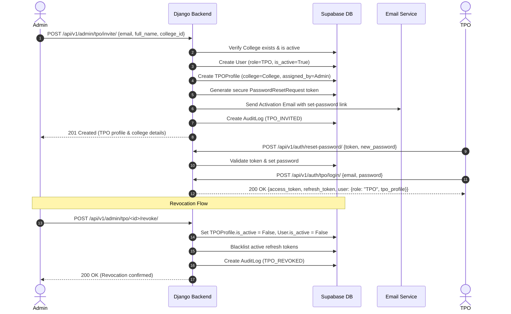

# GQT Student Portal — TPO Authorization & College Isolation Design

**Document Version:** 1.0  
**Status:** Approved Architectural Specification (Phase 1 Deliverable)  
**Target Roles:** Administrator (ADMIN), Training and Placement Officer (TPO), Student (STUDENT)  

---

## 1. Enterprise Role & Permission Matrix

The system implements a strict Role-Based Access Control (RBAC) model across all three primary user roles:

| Domain / Capability | Administrator (ADMIN) | Student (STUDENT) | TPO (Training & Placement Officer) |
| :--- | :---: | :---: | :---: |
| **User & Staff Management** | Full CRUD | None | None |
| **TPO Account Provisioning** | Create / Invite / Revoke | None | None |
| **College Creation & Configuration** | Full CRUD | Read-only (active list) | Read-only (assigned college only) |
| **Student Profile Management** | Full CRUD + Course Assignment | Self-Profile Edit (approved fields) | **Read-only (Assigned college students only)** |
| **Curriculum & Questions** | Full CRUD | Read & Execute Code | Read-only curriculum view |
| **Attendance Records** | Mark / Scan QR / Bulk Mark | Self-Attendance View + QR Display | **Read-only (Assigned college students only)** |
| **Submissions & Test Results** | View all | View self-submissions | **Read-only (Assigned college students only)** |
| **Points & Leaderboard** | Platform-wide Leaderboard | Global + Batch + Self | **College-Only Leaderboard & Stats** |
| **Placement Drives** | Create / Edit / Manage Applicants | View & Apply to Eligible Drives | **Read-only (Assigned college applicants only)** |
| **Analytics & Data Exports** | Platform-wide CSV / PDF | None | **College-Scoped CSV / PDF Exports** |
| **Self Profile Management** | Full Admin Profile Edit | Full Student Profile Edit | **Edit permitted TPO profile fields** |

---

## 2. Proposed Data Models for TPO Role

### 2.1 Extending `User.RoleChoices`
In `backend/apps/accounts/models.py`:
```python
class User(AbstractBaseUser, PermissionsMixin, BaseModel):
    class RoleChoices(models.TextChoices):
        ADMIN = "ADMIN", "Administrator / Staff"
        STUDENT = "STUDENT", "Student"
        TPO = "TPO", "Training & Placement Officer"
```

### 2.2 Dedicated `TPOProfile` Model
In `backend/apps/accounts/models.py` (or `apps/students/models.py`):
```python
class TPOProfile(BaseModel):
    """Institutional Training & Placement Officer (TPO) profile extension."""

    user = models.OneToOneField(
        settings.AUTH_USER_MODEL,
        on_delete=models.CASCADE,
        related_name="tpo_profile",
    )
    college = models.ForeignKey(
        "students.College",
        on_delete=models.PROTECT,
        related_name="tpo_officers",
        help_text="Institutional college explicitly assigned by Administrator.",
    )
    full_name = models.CharField(max_length=150)
    designation = models.CharField(
        max_length=100, default="Training & Placement Officer"
    )
    department = models.CharField(
        max_length=100, blank=True, default="Training & Placement Cell"
    )
    phone_number = models.CharField(max_length=30, blank=True, default="")
    avatar_url = models.URLField(max_length=500, blank=True, default="")
    is_active = models.BooleanField(
        default=True,
        db_index=True,
        help_text="Controls active authorization status for this institutional college.",
    )
    assigned_by = models.ForeignKey(
        settings.AUTH_USER_MODEL,
        null=True,
        blank=True,
        on_delete=models.SET_NULL,
        related_name="assigned_tpos",
    )
    assigned_at = models.DateTimeField(auto_now_add=True)

    class Meta:
        verbose_name = "TPO Profile"
        verbose_name_plural = "TPO Profiles"
        indexes = [
            models.Index(fields=["college", "is_active"], name="tpo_college_active_idx"),
            models.Index(fields=["user", "is_active"], name="tpo_user_active_idx"),
        ]

    def __str__(self):
        return f"{self.full_name} — {self.college.name} (TPO)"
```

---

## 3. Server-Side College Isolation Strategy

### 3.1 Zero-Trust Architecture
1. **No Client Trust:** The backend NEVER relies on query parameters (e.g., `?college_id=...`), headers, or request payload values to determine which college's records to fetch.
2. **Server-Derived Context:** The authenticated `request.user` is inspected. If `user.role == User.RoleChoices.TPO`, the backend queries `request.user.tpo_profile.college`.
3. **Revocation Gate:** If `user.is_active == False` OR `tpo_profile.is_active == False` OR `tpo_profile.college.is_active == False`, all requests immediately abort with HTTP 403 Forbidden.

### 3.2 Standard DRF Permission Classes
In `backend/apps/common/permissions.py`:
```python
class IsTPO(BasePermission):
    """Allows access strictly to authenticated, active TPO users with valid college assignment."""

    def has_permission(self, request, view):
        if not (request.user and request.user.is_authenticated and request.user.is_active):
            return False
        if getattr(request.user, "role", None) != User.RoleChoices.TPO:
            return False
        tpo_profile = getattr(request.user, "tpo_profile", None)
        return bool(tpo_profile and tpo_profile.is_active and tpo_profile.college and tpo_profile.college.is_active)


class IsTPOOrAdmin(BasePermission):
    """Allows access to administrators or authorized TPO officers."""

    def has_permission(self, request, view):
        if not (request.user and request.user.is_authenticated and request.user.is_active):
            return False
        if request.user.role == User.RoleChoices.ADMIN or request.user.is_staff or request.user.is_superuser:
            return True
        if request.user.role == User.RoleChoices.TPO:
            tpo_profile = getattr(request.user, "tpo_profile", None)
            return bool(tpo_profile and tpo_profile.is_active and tpo_profile.college and tpo_profile.college.is_active)
        return False
```

### 3.3 Queryset Scoping Pattern
All TPO views inherit from a base mixin or implement standard queryset filtering:
```python
class TPOCollegeScopedQuerySetMixin:
    """Ensures querysets are strictly constrained to the authenticated TPO's assigned college."""

    def get_college(self):
        user = self.request.user
        if user.role == User.RoleChoices.ADMIN:
            # Admins may filter by college if requested, or view all
            college_id = self.request.query_params.get("college_id")
            return College.objects.filter(id=college_id).first() if college_id else None
        return self.request.user.tpo_profile.college

    def scope_student_queryset(self, queryset):
        college = self.get_college()
        if self.request.user.role == User.RoleChoices.TPO:
            # Strict foreign key match
            return queryset.filter(college=college)
        elif college:
            return queryset.filter(college=college)
        return queryset
```

### 3.4 403 vs 404 Disclosure Policy
To prevent **IDOR Information Leakage** (where an attacker learns whether a `student_id` exists in another college via 403 vs 404 responses):
- **List & Detail Endpoints:** If a requested `student_id` or `submission_id` does not belong to the TPO's assigned college, the API returns **404 Not Found** (identical to non-existent records).
- **Unauthorized Role Actions:** If a TPO attempts to hit a mutation endpoint (e.g. `POST /api/v1/students/courses/`), the API returns **403 Forbidden**.

---

## 4. Admin TPO Management Workflow



---

## 5. Session Revocation & Invalidation Guarantees

1. **Token Blacklisting:** When an Admin deactivates a TPO, all active refresh tokens for that user are immediately added to `rest_framework_simplejwt.token_blacklist`.
2. **Access Token Short Lifespan:** Access tokens are short-lived (15 minutes).
3. **Database-Backed Middleware Check:** For sensitive analytics and exports, views verify real-time `user.is_active` and `tpo_profile.is_active` against the database, preventing stale access tokens from accessing protected data.
