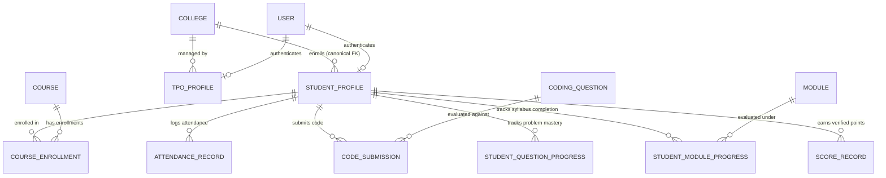

# GQT Student Portal — TPO Data Mapping & Dashboard Data Contract

**Document Version:** 1.0  
**Status:** Canonical Data Specification (Phase 1 Deliverable)  
**Database Authoritative Store:** Supabase (PostgreSQL) via Django ORM  

---

## 1. Canonical College & Student Relationship Architecture

### 1.1 The Single Source of Truth
The canonical identifier for all institutional college associations is:
$$\text{StudentProfile.college\_id} \longrightarrow \text{College.id (UUID)}$$



### 1.2 College Verification & Legacy Data Reconciliation
1. **Migration / Data Backfill:**
   - Existing profiles with `college_name` matching an active `College.name` (case-insensitive) will be backfilled with `college_id = matching_college.id`.
   - Django `pre_save` / `clean` hook on `StudentProfile` automatically synchronizes `college_name = college.name` when `college` is assigned.
2. **Missing / Unverified Associations Rule (Zero Guessing):**
   - Students with `college == NULL` are classified as **Unassigned / Unverified**.
   - TPO endpoints MUST filter `college=tpo_college`. Under NO circumstance will fuzzy matching or text heuristics be used to expose unassigned students to a TPO.
   - Admin retains exclusive ability to review, verify, and assign unlinked students to their canonical college.

---

## 2. TPO Dashboard Data Contract (12 Real Metrics)

| # | Metric Name | Source Model(s) | Calculation & Aggregation Rules | Distinguishing Zero vs Missing Data |
| :--- | :--- | :--- | :--- | :--- |
| **1** | **Total Enrolled Students** | `StudentProfile` | `StudentProfile.objects.filter(college=tpo_college).count()` | Genuine `0` if college has no enrolled students. |
| **2** | **Active vs Inactive Students** | `StudentProfile`, `User` | Active: `filter(college=tpo_college, user__is_active=True, user__onboarding_status='ACTIVE')`<br>Inactive: `user__is_active=False` or `user__onboarding_status='SUSPENDED'`. | Explicit breakdown: `{ active: N, inactive: N, pending: N }`. |
| **3** | **Technology Track Distribution** | `StudentProfile`, `CourseEnrollment`, `Course` | `StudentProfile.objects.filter(college=tpo_college).values('course_opted').annotate(count=Count('id'))` | Empty list `[]` if no students; distinct tracks labeled accurately. |
| **4** | **Course & Module Completion** | `CourseEnrollment`, `StudentModuleProgress` | Enrolled: `CourseEnrollment.objects.filter(student__college=tpo_college, status='ACTIVE')`<br>Completed: `filter(status='COMPLETED')`<br>Completion Rate: `(completed / total) * 100`. | Return `null` / "No enrollments" if total is 0 to prevent division by zero. |
| **5** | **Attendance Telemetry & Sessions** | `StudentProfile`, `AttendanceRecord` | Average Attendance: `StudentProfile.objects.filter(college=tpo_college).aggregate(avg=Avg('attendance_percentage'))`<br>Session Count: `AttendanceRecord.objects.filter(student_profile__college=tpo_college).count()`. | If `total_sessions == 0`, report `attendance_rate: null` ("No sessions recorded") rather than `0.00%`. |
| **6** | **Algorithmic Question Submissions** | `CodeSubmission`, `StudentQuestionProgress` | Total Submissions: `CodeSubmission.objects.filter(student__college=tpo_college).count()`<br>Solved Count: `StudentQuestionProgress.objects.filter(student__college=tpo_college, is_solved=True).count()`<br>Pass Rate: `(accepted_submissions / total_submissions) * 100`. | If total submissions is 0, report `pass_rate: null` ("No submissions yet"). |
| **7** | **Verified Student Scores & Streaks** | `StudentProfile`, `ScoreRecord` | Total Points: `StudentProfile.objects.filter(college=tpo_college).aggregate(Sum('total_points'))`<br>Average Score: `Avg('total_points')`<br>Active Streaks: `filter(college=tpo_college, current_streak_days__gt=0).count()`. | Average `0.00` is genuine zero points; distinguish from "Not enrolled". |
| **8** | **College-Only Leaderboard** | `StudentProfile`, `LeaderboardService` | Ranked by: `1. total_points DESC, 2. solved_questions_count DESC, 3. current_streak_days DESC, 4. created_at ASC`<br>Scoped strictly to `college=tpo_college`. | Returns empty list if no active students. |
| **9** | **Tech-wise Performance Breakdown** | `StudentProfile`, `ScoreRecord`, `StudentQuestionProgress` | Grouped by `course_opted` or `technology`, averaging points, solved questions, and attendance. | Distinct categories with actual non-null aggregates. |
| **10** | **Progress & Activity Trends** | `DailyStudentAnalytics`, `ActivityEvent` | Daily aggregate of questions solved, submissions made, and scores earned over 7d, 30d, 90d periods. | Days with 0 activity show genuine `0` value on time series chart. |
| **11** | **Multi-Dimensional Query Filters** | All TPO Endpoints | Supported query parameters: `batch_code`, `technology`, `graduation_year`, `date_from`, `date_to`, `search`. | Sanitized via DjangoFilterBackend with strict validation. |
| **12** | **Secure Scoped Exports (CSV / PDF)** | `ExportJob`, `apps.analytics.services` | Background generation of CSV/PDF containing strictly `student__college=tpo_college`. | Output file path signed or streamed via authenticated endpoint. |

---

## 3. TPO API Endpoint Contracts

All endpoints live under `/api/v1/tpo/` and require `Authorization: Bearer <JWT>` with `IsTPO` permission.

### 3.1 `GET /api/v1/tpo/dashboard/`
**Response Payload:**
```json
{
  "college": {
    "id": "3fa85f64-5717-4562-b3fc-2c963f66afa6",
    "name": "Bangalore Institute of Technology",
    "code": "BIT",
    "city": "Bangalore",
    "state": "Karnataka"
  },
  "metrics": {
    "total_students": 120,
    "active_students": 115,
    "inactive_students": 5,
    "average_attendance_percentage": "92.40",
    "total_questions_solved": 1450,
    "average_points": "345.50",
    "active_streak_students_count": 48
  },
  "track_distribution": [
    { "course_opted": "Full Stack Software Track", "student_count": 75 },
    { "course_opted": "Data Engineering Track", "student_count": 45 }
  ],
  "attendance_trends": [
    { "date": "2026-10-01", "present_count": 110, "absent_count": 10 }
  ],
  "top_performers": [
    {
      "rank": 1,
      "student_id": "9b1deb4d-3b7d-4bad-9bdd-2b0d7b3dcb6d",
      "student_id_number": "GQT2600123",
      "full_name": "Aditi Rao",
      "batch_code": "BATCH-2026-A",
      "total_points": 820.0,
      "solved_questions_count": 35,
      "current_streak_days": 14
    }
  ]
}
```

### 3.2 `GET /api/v1/tpo/students/`
**Query Parameters:** `search`, `batch_code`, `course_opted`, `graduation_year`, `ordering`, `page`, `page_size`.  
**Response Payload:** Standard DRF Paginated Response with `count`, `next`, `previous`, `results`.  
*Restricted Data:* No student passwords, reset tokens, or unrelated institutional data.

### 3.3 `GET /api/v1/tpo/students/<uuid:student_id>/`
**Response Payload:** Detailed academic profile, course enrollments, question solved list, attendance history, score records.  
*Isolation Guarantee:* If `student.college_id != request.user.tpo_profile.college_id`, returns `404 Not Found`.

### 3.4 `GET /api/v1/tpo/leaderboard/`
**Query Parameters:** `batch_code`, `course_id`.  
**Response Payload:** Top performers within the TPO's assigned college.

### 3.5 `POST /api/v1/tpo/reports/export/`
**Request Payload:** `{ "report_type": "STUDENT_PERFORMANCE", "format": "CSV", "filters": { "batch_code": "BATCH-2026-A" } }`  
**Response Payload:** `{ "job_id": "...", "status": "PENDING" }`
