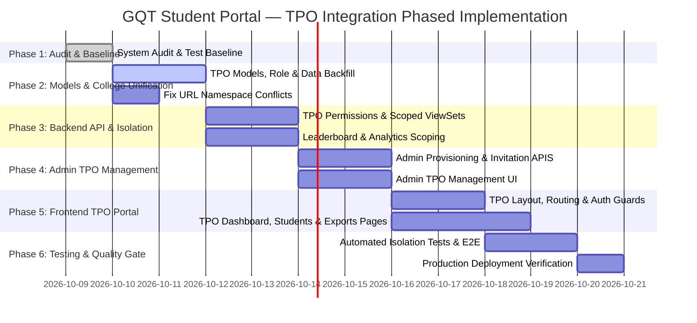

# GQT Student Portal — TPO Integration Implementation Plan (Phases 1–6)

**Document Version:** 1.0  
**Status:** Architectural Blueprint & Phased Execution Plan  
**Target Architecture:** React + TypeScript (Vite) Frontend, Django + DRF Backend, Supabase Database  

---

## 1. Phased Roadmap Overview

---

## 2. Detailed Phase Breakdown

### Phase 1: Audit & Baseline Verification *(Current Phase — COMPLETE)*
- **Objective:** Establish baseline diagnostics, analyze models, verify college mapping, identify risks.
- **Deliverables:**
  - `TPO_PORTAL_AUDIT.md`
  - `TPO_AUTHORIZATION_DESIGN.md`
  - `TPO_DATA_MAPPING.md`
  - `TPO_IMPLEMENTATION_PLAN.md`
- **Completion Gate:** System audit signed off before proceeding to Phase 2.

---

### Phase 2: Backend Data Models & College Harmonization
- **Objective:** Add `TPO` role, create `TPOProfile`, harmonize `StudentProfile.college` foreign key, resolve URL namespace warnings.
- **Tasks:**
  1. Add `TPO = "TPO", "Training & Placement Officer"` to `User.RoleChoices` in `apps/accounts/models.py`.
  2. Create `TPOProfile` model with `OneToOneField(User)` and `ForeignKey(College, on_delete=PROTECT)`.
  3. Create Django database migration (`0006_add_tpo_profile_and_role`).
  4. Write a non-destructive data backfill migration to link existing `StudentProfile` rows whose `college_name` matches a `College.name`.
  5. Add `clean()` and `save()` handlers to maintain `college_name` in sync with `college.name`.
  6. Fix the URL namespace conflict in `backend/config/urls.py` by removing redundant `colleges/` route includes.
- **Acceptance Criteria:**
  - `makemigrations` and `migrate` execute cleanly without schema degradation.
  - Existing student records retain their academic history.
  - `pytest` runs with 100% pass rate (236/236 passing).

---

### Phase 3: Server-Side TPO API Layer & College Isolation
- **Objective:** Implement dedicated TPO backend endpoints scoped strictly by the authenticated TPO's assigned college.
- **Tasks:**
  1. Create `apps/accounts/permissions.py` / `apps/common/permissions.py` permission classes: `IsTPO`, `IsTPOOrAdmin`.
  2. Create `apps/students/tpo_views.py` and `apps/students/tpo_serializers.py`:
     - `TPODashboardView` (KPI metrics, attendance overview, track distribution).
     - `TPOStudentListView` (paginated, filtered by batch, track, year).
     - `TPOStudentDetailView` (academic progress, scores, attendance history).
     - `TPOAttendanceOverviewView` (college-wide session logs).
     - `TPOLeaderboardView` (college-scoped ranking).
     - `TPOPlacementDrivesView` (college-eligible placement opportunities).
     - `TPOProfileMeView` (self-profile retrieval and permitted update).
  3. Create `apps/students/tpo_urls.py` registered under `/api/v1/tpo/`.
  4. Implement college-scoped query filtering in `LeaderboardService` (`leaderboard_top10_college_{id}`).
  5. Implement college-scoped report export service in `apps/analytics/services.py`.
- **Acceptance Criteria:**
  - All TPO endpoints reject unauthenticated or non-TPO requests with 401/403.
  - Requesting any student from another college returns 404 Not Found (zero information leakage).
  - No client-supplied college parameters are accepted as authorization proof.

---

### Phase 4: Admin TPO Management Workflows
- **Objective:** Enable platform administrators to invite, provision, assign colleges to, and manage TPO accounts.
- **Tasks:**
  1. Backend Admin TPO APIs:
     - `POST /api/v1/admin/tpos/` (provision/invite TPO with email, full name, and college assignment).
     - `GET /api/v1/admin/tpos/` (list all TPOs with college and activity status).
     - `PATCH /api/v1/admin/tpos/<id>/` (reassign college, edit profile).
     - `POST /api/v1/admin/tpos/<id>/revoke/` (suspend/revoke TPO access and blacklist JWT tokens).
  2. Frontend Admin TPO Management UI:
     - Add `TPOsPage.tsx` under `/admin/tpos` with searchable data table, status badges, college selectors, and invite modal.
     - Add TPO navigation item in `AdminLayout` sidebar.
- **Acceptance Criteria:**
  - Admin can successfully invite a TPO to an active college.
  - Revoking a TPO instantly blocks their access to all endpoints.

---

### Phase 5: Frontend TPO Portal Integration
- **Objective:** Deliver a responsive, modern, dark-mode/light-mode UI for TPO officers with zero cross-portal pollution.
- **Tasks:**
  1. Auth Store & Types:
     - Extend `UserRole` in `types/auth.ts` to include `"TPO"`.
     - Add `TPOProfile` interface to `types/auth.ts`.
     - Update `useAuthStore` to store and hydrate `tpoProfile`.
  2. Router & Guards:
     - Add `TPORouteGuard` ensuring `user.role === "TPO"`.
     - Update `RootRedirector` to redirect TPO users to `/tpo/dashboard`.
     - Add `/tpo/login` route.
  3. TPO Layout (`components/layout/TPOLayout.tsx`):
     - Distinct institutional college header badge.
     - Sidebar with links: Dashboard, Students, Attendance, Leaderboard, Placements, Reports, Profile.
  4. TPO Pages:
     - `TPODashboardPage.tsx` (real statistics cards, track charts, attendance trends).
     - `TPOStudentsPage.tsx` (searchable data table, multi-dimensional filters, pagination).
     - `TPOStudentDetailPage.tsx` (profile details, module mastery, attendance rate, submissions).
     - `TPOAttendancePage.tsx` (daily session logs and student percentage breakdowns).
     - `TPOLeaderboardPage.tsx` (college ranking with Top 3 highlight markers).
     - `TPOReportsPage.tsx` (asynchronous CSV/PDF export generator).
     - `TPOProfilePage.tsx` (self-management of contact info and password).
- **Acceptance Criteria:**
  - Seamless navigation adhering to modern UI/UX standards.
  - Loading skeletons, empty states, and error handling for all views.
  - `npm run build` and `npm test` execute with 0 warnings/errors.

---

### Phase 6: Automated Test Suite & Security Validation
- **Objective:** Implement comprehensive automated unit, integration, and IDOR security tests.
- **Tasks:**
  1. Backend test suite (`apps/students/tests/test_tpo_api.py`):
     - `test_tpo_login_and_token_issuance`
     - `test_tpo_dashboard_metrics_calculation`
     - `test_tpo_cannot_see_other_college_students` (Cross-college isolation)
     - `test_tpo_cannot_mutate_student_records` (Read-only guarantee)
     - `test_deactivated_tpo_is_denied_access` (Revocation enforcement)
     - `test_admin_tpo_lifecycle` (Provision, invite, revoke)
  2. Frontend unit tests for `tpoAuth` and TPO dashboard metrics rendering.
- **Acceptance Criteria:**
  - 100% test pass rate across backend and frontend suites.
  - Security audit confirms zero IDOR vulnerabilities.

---

## 3. Rollback & Risk Mitigation Plan

1. **Database Rollbacks:** Every migration will have a corresponding reversible unapply operation (`python manage.py migrate <app> <previous_migration>`).
2. **Foreign Key Protection:** `College` records referenced by `TPOProfile` will use `on_delete=models.PROTECT` to prevent accidental institutional data loss.
3. **Feature Isolation:** All TPO routes and backend URLs are segregated under `/tpo/*` and `/api/v1/tpo/*`, ensuring zero regression risk to the existing Student and Admin portals.
