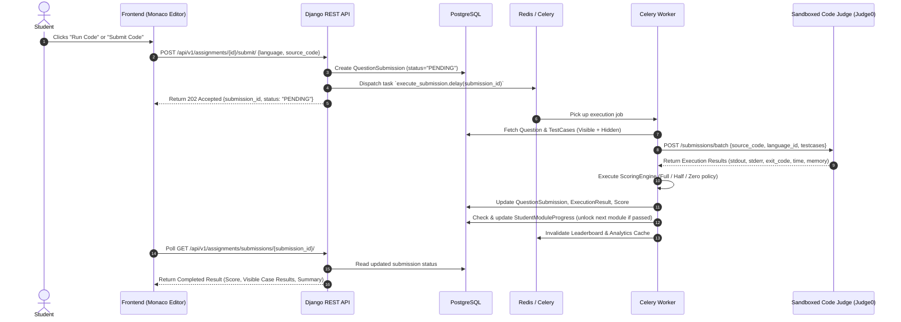

# System Architecture Specification

## 1. Executive Overview

The **GQT Student Learning and Coding Assessment Platform** is an enterprise-grade learning and assessment ecosystem designed to support high concurrent student loads with rock-solid security, automated multi-language code evaluation, real-time analytics, and an integrated AI tutor.

The platform enforces a strict **Admin-Controlled Onboarding Model** (zero public self-registration) and a strictly gated **17-Topic Sequential Curriculum**.

---

## 2. High-Level Architecture Diagram

```mermaid
graph TD
    subgraph Client["Frontend Layer (React 18 + Vite + TS)"]
        UI[Tailwind + Framer Motion UI]
        State[TanStack Query v5 + Zustand Store]
        Monaco[Monaco Code Editor]
    end

    subgraph Gateway["Reverse Proxy & Gateway"]
        Nginx[Nginx Reverse Proxy / SSL Termination]
    end

    subgraph BackendCluster["Backend Layer (Django REST Framework)"]
        WSGI[Gunicorn WSGI / ASGI Workers]
        AuthApp[apps/accounts & apps/students]
        CurriculumApp[apps/courses & apps/modules]
        AssessmentApp[apps/assignments & apps/scoring]
        ProjectApp[apps/projects & apps/tasks]
        AIApp[apps/ai_assistant]
        LeaderboardApp[apps/leaderboard & apps/analytics]
    end

    subgraph ServiceLayer["Service & Business Logic Layer"]
        Services[Domain Services\n(No logic in Serializers/Views)]
    end

    subgraph AsyncLayer["Async Processing & Messaging (Celery + Redis)"]
        CeleryWorker[Celery Task Workers]
        CeleryBeat[Celery Beat Scheduler]
        RedisBroker[(Redis 7 - Broker & Result Backend & Cache)]
    end

    subgraph DataLayer["Persistence Layer"]
        Postgres[(PostgreSQL 16 Primary DB)]
    end

    subgraph ExternalServices["External Sandboxes & AI Providers"]
        JudgeEngine[Isolated Sandbox Judge Engine\n(Judge0 / Piston / isolate)]
        LLMProvider[External AI / LLM Provider\n(OpenAI / Anthropic API)]
        SMSGateway[SMS / OTP Gateway]
    end

    Client -->|HTTPS / REST API + Bearer JWT| Nginx
    Nginx --> WSGI
    WSGI --> AuthApp & CurriculumApp & AssessmentApp & ProjectApp & AIApp & LeaderboardApp
    AuthApp & CurriculumApp & AssessmentApp & ProjectApp & AIApp & LeaderboardApp --> Services
    Services --> Postgres
    Services --> RedisBroker
    Services -->|Async Tasks Queue| CeleryWorker
    CeleryWorker --> JudgeEngine
    CeleryWorker --> LLMProvider
    CeleryWorker --> SMSGateway
    CeleryWorker --> Postgres
    CeleryBeat --> RedisBroker
```

---

## 3. Monorepo Organization & Directory Topology

The codebase uses a clean, decoupled monorepo structure. There are strict boundaries between presentation, backend domain logic, cloud infrastructure, and operational scripts.

```text
/frontend/         # Single Page Application (React, Vite, TS, Tailwind)
/backend/          # API & Business Services (Django, DRF, Celery)
/infrastructure/   # Docker configurations, compose specs, reverse proxy configs
/docs/             # Full architectural documentation, schema designs, and ADRs
/scripts/          # Automation tooling, local development bootstrap, seeders
```

---

## 4. Backend Application Architecture

### 4.1 Django Modular Application Structure
To avoid monolithic bloat, the backend decomposes domain responsibilities across targeted Django apps under `/backend/apps/`:

| App Name | Domain Responsibility | Key Entities |
|---|---|---|
| `accounts` | Authentication, RBAC, Users, Roles, OTP, Tokens | `User`, `Role`, `AdminProfile`, `AuditLog` |
| `students` | Student Profiles, Academic batches, Enrollment identity | `StudentProfile` |
| `courses` | Course definitions, syllabi, enrollments | `Course`, `CourseEnrollment` |
| `modules` | 17 sequential topics, unlock rules, progression | `Module`, `StudentModuleProgress` |
| `assignments` | Coding questions, visible/hidden test cases, submissions | `Question`, `TestCase`, `QuestionSubmission` |
| `execution` | Sandbox dispatch, queue management, status polling | `ExecutionResult` |
| `scoring` | Grading evaluation (Full/Half/Zero policy), rubric scoring | `Score` |
| `leaderboard` | Real-time & aggregated ranking, points, streaks | `Leaderboard` |
| `tasks` | Daily coding tasks, streaks, task completions | `Task`, `TaskCompletion` |
| `projects` | Capstone projects, GitHub links, ZIP uploads, reviews | `Project`, `ProjectSubmission`, `ProjectFile` |
| `ai_assistant` | Contextual learning AI tutor, message threads, guardrails | `AIConversation`, `AIMessage` |
| `notifications` | In-app alerts, push notifications, global broadcasts | `Notification`, `Announcement` |
| `analytics` | Metrics tracking, completion rates, batch performance | Aggregated metrics |
| `reports` | Student diagnostics, batch exports (CSV/PDF) | Report generation |
| `certificates` | Verifiable course completion certificates and badges | `Badge`, `Certificate` |
| `contact` | Student inquiries, technical helpdesk tickets | Support tickets |
| `common` | Abstract models, base services, custom exceptions, audit logging | Base classes, pagination, permissions |

### 4.2 Architectural Design Principles

#### 1. Thin Views & Controllers
Django Views (APIViews / ViewSets) are responsible **only** for:
- Request validation via serializers
- Permission / Authentication checks
- Calling a specific Service Layer function
- Returning standardized HTTP response envelopes

#### 2. Service-Layer Pattern
All business logic is isolated in dedicated service classes (`services.py` inside each app). Serializers only validate data schemas and format responses. Serializers **never** contain business workflow logic, external API requests, or complex multi-table mutations.

```text
HTTP Request ──> ViewSet/APIView ──> Serializer.is_valid()
                                              │
                                              ▼
                                    Service Layer Method
                                    (Transaction, Rules, Events)
                                              │
                      ┌───────────────────────┴───────────────────────┐
                      ▼                                               ▼
               PostgreSQL ORM                                 Celery Async Job
```

#### 3. Database Integrity & Transaction Safety
- Critical state mutations (e.g., student submission evaluation, module unlocking, score tallying) run inside atomic transactions (`transaction.atomic()`).
- Database foreign keys use `select_related` and `prefetch_related` to eliminate $N+1$ query issues.
- Soft-deletes are handled through an abstract `BaseModel` using explicit `is_active` flags where audit trails are required.

---

## 5. Frontend Architecture

The frontend is built using **React 18**, **TypeScript**, and **Vite**, structured around a **Feature-Driven Architecture**:

```text
frontend/src/
├── app/                  # Application root provider tree & router initialization
├── components/           # Global design system components (buttons, modals, tables)
├── features/             # Business modules grouped by domain
│   ├── auth/             # Login, OTP verification, password reset
│   ├── admin/            # Admin student onboarding, content management, reviews
│   ├── student/          # Student dashboard, roadmap, statistics
│   ├── courses/          # Course listing, syllabus overview
│   ├── modules/          # 17 sequential topic viewer, locking mechanics
│   ├── coding/           # Monaco editor, multi-language runner, testcase runner
│   ├── leaderboard/      # Global & batch leaderboard views
│   ├── tasks/            # Daily challenges & streak calendar
│   ├── projects/         # Project brief, repository linking, file upload, feedback
│   ├── ai_assistant/     # Floating AI tutor drawer, chat thread, syntax highlighting
│   ├── notifications/    # Notification popover, announcements feed
│   └── certificates/     # Certificate showcase, badge rack
├── layouts/              # App shells: StudentLayout, AdminLayout, AuthLayout
├── routes/               # Route declarations, ProtectedRoute, RoleGuard
├── hooks/                # Global custom hooks (useAuth, useDebounce, useLocalStorage)
├── services/             # Third-party SDK wrappers
├── api/                  # Axios instance, interceptors, standardized API client
├── store/                # Lightweight Zustand stores (Auth session, Editor preferences)
├── types/                # Strict TypeScript interfaces matching backend DTOs
├── schemas/              # Zod validation schemas for all form inputs
├── utils/                # Pure formatting, time calculation, string manipulation
├── constants/            # Curriculum topics, language configurations, storage keys
├── assets/               # Images, SVG illustrations, logos
└── styles/               # Tailwind CSS theme variables and global styles
```

### State Management Philosophy:
- **Server Cache State:** Handled exclusively by **TanStack Query v5** (stale-while-revalidate, automatic retry, optimistic updates, cache invalidation).
- **Client Session State:** Handled by **Zustand** for lightweight global needs (active auth tokens, user profile metadata, Monaco editor theme/preferences, sidebar collapse state).
- **Form State:** Handled by **React Hook Form** with **Zod** schema validation.

---

## 6. Asynchronous Jobs & Code Execution Pipeline

Untrusted user code is **never** executed on the backend application server. The flow below illustrates the decoupled evaluation pipeline:



---

## 7. Curriculum Progression Rules

The 17 sequential topics are hard-locked:
1. Module $1$ (*Data Types*) is unlocked upon student onboarding.
2. Modules $2 \dots 17$ remain locked until the student achieves an approved passing score on Module $K-1$.
3. Passing criteria require satisfying:
   - 100% of visible test cases passing.
   - At least 80% of hidden test cases passing.
   - Zero syntax/compilation errors.
4. Admins have manual override authority via the Admin Portal to unlock modules or reset progress.
