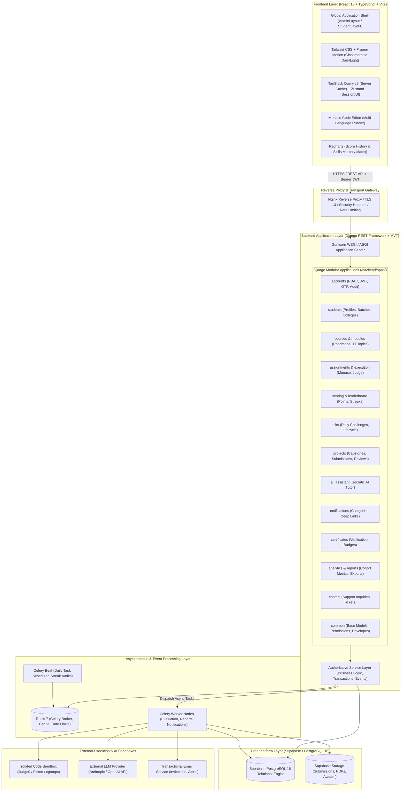
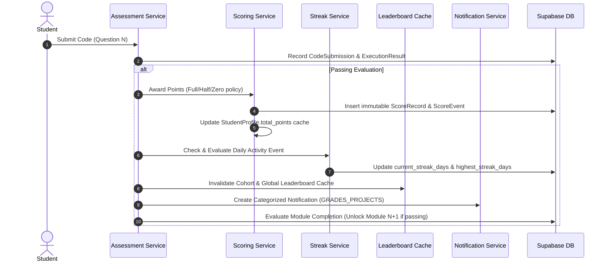

# System Architecture Specification — Phase 0

## 1. Executive Overview

The **GQT Student Learning and Coding Assessment Platform** is an enterprise-grade, high-concurrency learning management and algorithmic coding assessment ecosystem. It supports automated multi-language code evaluation, real-time cohort analytics, structured curriculum roadmaps, gamified streaks/verified points, and contextual AI tutoring.

The platform enforces:
1. **Admin-Controlled Provisioning Model**: Zero public self-registration; accounts and access lifecycles are authoritatively provisioned and managed by platform administrators.
2. **17-Topic Sequential Curriculum**: Strict prerequisite progression gating preventing forward access until prerequisite topics achieve verified mastery.
3. **Dual-Role Global Shell**: Unified, role-aware application shell powering both **Admin Portal** and **Student Portal** with synchronized real-time state, dark mode, responsive data tables, breadcrumbs, and deep linking.
4. **Authoritative Backend Domain Scoring**: Verifiable points, streak mechanics, leaderboards, and grading calculations are computed exclusively on the backend service layer and persisted in Supabase.

---

## 2. High-Level System Architecture Diagram



---

## 3. Monorepo Organization & Directory Topology

The project preserves the clean, decoupled monorepo structure with strict isolation between presentation, backend domain logic, cloud infrastructure, and operational scripts.

```text
student-portal/
├── frontend/                     # React 18 + TypeScript + Vite Single Page Application
│   ├── src/
│   │   ├── api/                  # Axios instance, interceptors, typed endpoints
│   │   ├── app/                  # Provider tree, router initialization, QueryClient
│   │   ├── assets/               # Branding, icons, static SVG illustrations
│   │   ├── components/           # Reusable Design System UI library
│   │   │   ├── ui/               # Atoms: Button, Badge, Modal, Card, Dropdown
│   │   │   ├── forms/            # Form controls, inputs, selects, validation wrappers
│   │   │   ├── tables/           # Responsive DataTable, pagination, action menus
│   │   │   └── charts/           # Recharts wrappers (Score History, Skills Radar)
│   │   ├── constants/            # Topic enums, languages, theme configurations
│   │   ├── context/              # React Contexts (ThemeContext, SocketContext)
│   │   ├── features/             # Feature modules (Business logic & components)
│   │   │   ├── admin/            # Admin student table, problem manager, credentials
│   │   │   ├── ai/               # Floating AI Socratic tutor drawer
│   │   │   ├── assignments/      # Coding runner, Monaco editor integration
│   │   │   ├── auth/             # Login, OTP verification, password recovery
│   │   │   ├── certificates/     # Certificate viewer, public verification badge
│   │   │   ├── contact/          # Support inquiry ticket submission form
│   │   │   ├── courses/          # Course listing, syllabus, roadmap, deep links
│   │   │   ├── dashboard/        # Student overview, live streak, score metrics
│   │   │   ├── leaderboard/      # Cohort leaderboard, Top-3 spotlight, You indicator
│   │   │   ├── notifications/    # Notification center, categorized alerts
│   │   │   ├── profile/          # Student profile view, batch & college details
│   │   │   ├── projects/         # Capstone project briefs, repository linking
│   │   │   └── tasks/            # Daily tasks calendar, pending/complete filters
│   │   ├── hooks/                # Custom React hooks (useAuth, useStudentSummary)
│   │   ├── layouts/              # Shells: AdminLayout, StudentLayout, AuthLayout
│   │   ├── pages/                # Route container views (Admin & Student)
│   │   ├── routes/               # Route definitions, ProtectedRoute, RoleGuard
│   │   ├── schemas/              # Zod validation schemas matching backend DTOs
│   │   ├── services/             # Client-side utility services
│   │   ├── store/                # Zustand stores (Auth session, theme, editor)
│   │   ├── styles/               # Tailwind CSS, glassmorphism tokens, globals
│   │   └── types/                # Strict TypeScript interfaces matching backend DTOs
│   └── package.json
│
├── backend/                      # Django REST Framework + Celery Core
│   ├── manage.py
│   ├── config/                   # Central configuration & runtime settings
│   │   ├── settings/
│   │   │   ├── base.py           # Shared settings, installed apps, middleware
│   │   │   ├── development.py    # Local debug settings, Supabase pooler
│   │   │   ├── staging.py        # Staging environment config
│   │   │   └── production.py     # Production security, Sentry, strict CORS
│   │   ├── urls.py               # Root URL router (/api/v1/...)
│   │   ├── asgi.py               # ASGI async configuration
│   │   ├── wsgi.py               # WSGI Gunicorn configuration
│   │   └── celery.py             # Celery distributed worker bootstrap
│   │
│   └── apps/                     # Modular Django domain applications
│       ├── accounts/             # Identity, RBAC, User models, OTP, AuditLog
│       ├── students/             # StudentProfile, CohortBatch, Institution
│       ├── courses/              # Course, CourseEnrollment (Active, Completed, etc.)
│       ├── modules/              # 17 Sequential Topics, Prerequisites, Unlock Engine
│       ├── assignments/          # CodingQuestions, TestCases, CodeSubmissions
│       ├── execution/            # Sandbox dispatcher, Judge0 integration
│       ├── scoring/              # ScoreRecords, Points Engine, LeaderboardSnapshots
│       ├── leaderboard/          # Cohort and Global leaderboard materialized queries
│       ├── tasks/                # DailyTask, StudentTask lifecycle, streak triggers
│       ├── projects/             # Capstones, Submissions, Files, Code Reviews
│       ├── ai_assistant/         # Socratic AI tutor conversations and token guardrails
│       ├── notifications/        # Categorized notifications, broadcasts, read tracking
│       ├── certificates/         # Unique certificate generator, SHA verification
│       ├── analytics/            # Aggregation pipelines, 7-day score histories, skills
│       ├── reports/              # Background CSV/PDF export jobs
│       ├── contact/              # Support inquiry tickets & lifecycle management
│       └── common/               # UUIDModel, BaseService, standard API envelopes
│
├── infrastructure/               # Docker, Nginx, Compose, Sandbox configurations
├── docs/                         # Architecture, API, Supabase, Security blueprints
└── scripts/                      # Bootstrap, seeding, migration, health-check scripts
```

---

## 4. Backend Application Architecture & Modular Design

### 4.1 Django Application Responsibilities

| App Name | Domain Responsibility | Authoritative Entities & Models |
|---|---|---|
| `accounts` | Identity, Dual-state account management, RBAC, OTP, AuditLog | `User`, `Role`, `AdminProfile`, `LoginActivity`, `OTPVerification`, `AuditLog` |
| `students` | Academic profile, Cohort/Batch relationships, College/Institution | `StudentProfile`, `CohortBatch`, `Institution` |
| `courses` | Course catalog, Explicit enrollment lifecycle state machine | `Course`, `CourseEnrollment` |
| `modules` | 17 sequential topics, Prerequisite DAG, Unlock state engine | `Module`, `ModulePrerequisite`, `StudentModuleProgress` |
| `assignments` | Problem authoring, Testcase isolation, Submissions | `CodingQuestion`, `TestCase`, `CodeSubmission`, `ExecutionResult`, `StudentQuestionProgress` |
| `execution` | Sandbox dispatch, Time/Memory constraints, Polling | `SandboxJob`, `ExecutionMetric` |
| `scoring` | Verified Points engine, Point events, Streak rules | `ScoreRecord`, `ScoreEvent`, `LeaderboardSnapshot` |
| `leaderboard` | Cohort-scoped & Global rankings, "(You)" identity | Materialized dynamic ranking queries, Redis caches |
| `tasks` | Daily coding challenges, Daily completion lifecycle | `Task`, `StudentTask` |
| `projects` | Capstones, GitHub/ZIP submissions, Admin review/grading | `Project`, `ProjectSubmission`, `ProjectFile`, `ProjectFeedback` |
| `ai_assistant` | Socratic AI tutor, Guardrailed hints, Prompt boundaries | `AIConversation`, `AIMessage` |
| `notifications` | Categorized alerts, Deep linking, Read tracking | `Notification`, `Announcement`, `NotificationPreference` |
| `certificates` | Verifiable certificates, SHA-256 hash checks, Badges | `Certificate`, `Badge`, `StudentBadge` |
| `analytics` | Aggregations, 7-day score trends, Skills mastery matrix | `ActivityEvent`, `DailyStudentAnalytics`, `SkillMetric` |
| `reports` | Async batch exports (CSV, PDF), Performance auditing | `ReportJob`, `ExportRecord` |
| `contact` | Support tickets, Categorized student inquiries, Status | `ContactInquiry`, `InquiryResponse` |
| `common` | Abstract base models, Envelopes, Permissions, Exceptions | `UUIDModel`, `TimeStampedModel`, `BaseService` |

### 4.2 Architectural Design Principles

#### 1. Thin Views & ViewSets
APIViews and ViewSets are strictly controllers:
- Validate input payloads through DRF Serializers.
- Enforce permissions and authentication guards (`IsAuthenticated`, `IsAdminUser`, `IsStudentUser`, `IsResourceOwner`).
- Delegate all domain workflows and state mutations to dedicated Service Layer classes.
- Wrap results in standard response envelopes.

#### 2. Service-Layer Pattern
All business rules, transactional logic, cross-table mutations, and event triggers reside in `services.py` within each domain app. Serializers and Models never perform multi-table mutations or trigger async jobs directly.

```text
HTTP Request ──> ViewSet / APIView ──> Serializer.is_valid()
                                               │
                                               ▼
                                     Service Layer Method
                                (apps.<domain>.services)
                                               │
                       ┌───────────────────────┴───────────────────────┐
                       ▼                                               ▼
              Supabase PostgreSQL                              Celery Async Queue
           (transaction.atomic())                           (Redis Event Dispatch)
```

#### 3. Cross-Feature Domain Event Architecture
Business events naturally trigger cascading updates across multiple features. Rather than tight coupling between views, domain services orchestrate events cleanly:



---

## 5. Frontend Architecture & Design System

### 5.1 Presentation Philosophy
Built with **React 18**, **TypeScript**, **Vite**, **Tailwind CSS**, and **Framer Motion**, the frontend uses a Feature-Driven architecture.

### 5.2 Global Application Shells
The application provides two unified shell layouts:
1. **`AdminLayout`**:
   - Brand indicator (`GQT Portal - ADMIN`).
   - Dynamic Admin profile header (Avatar, Name, Email, Administrator badge, Theme toggle, Sign out).
   - Sidebar navigation: Dashboard, Students, Courses, Assignments, Daily Tasks, Projects, Certificates, Announcements, Support Inquiries, Analytics, Reports.
   - Breadcrumb navigation, responsive mobile drawer, sticky header.
2. **`StudentLayout`**:
   - Brand indicator (`GQT Portal - STUDENT`).
   - Dynamic Student summary header (Avatar, Name, Student ID, Cohort Badge `BATCH-2026-A`, Verified Points badge `200 pts`, Daily Streak badge `5 days`, Notification bell with unread badge, Profile dropdown, Sign out).
   - Sidebar navigation: Dashboard, Courses, Assignments, Daily Tasks, Projects, AI Tutor, Notifications, Profile, Contact.
   - Dynamic breadcrumb trail, responsive collapsible drawer.

### 5.3 Reusable Design System Component Catalog

```text
frontend/src/components/
├── ui/
│   ├── ActionMenu.tsx          # Dropdown action menu (View, Edit, Archive, Reset)
│   ├── Breadcrumbs.tsx         # Route-driven dynamic breadcrumb hierarchy
│   ├── ConfirmDialog.tsx       # Accessible modal for dangerous/destructive actions
│   ├── EmptyState.tsx          # Consistent empty state with icon, message & CTA
│   ├── ErrorState.tsx          # Standard error fallback with retry trigger
│   ├── LoadingState.tsx        # Skeleton loaders & spinner indicators
│   ├── Modal.tsx               # Accessible backdrop dialog
│   ├── PageHeader.tsx          # Title, description, action buttons bar
│   ├── ProgressBar.tsx         # Curriculum & module percentage bar
│   ├── RoleBadge.tsx           # Dynamic ADMIN vs STUDENT role pill
│   ├── StatusBadge.tsx         # Account/Access/Task/Submission status indicator
│   ├── StreakBadge.tsx         # Fire icon + active streak counter pill
│   ├── PointsBadge.tsx         # Verified points token indicator
│   ├── ThemeToggle.tsx         # Light / Dark mode toggle switch
│   └── UserAvatar.tsx          # Fallback-aware profile image / initials avatar
├── forms/
│   ├── FilterSelect.tsx        # Styled single/multi-select filter dropdown
│   ├── SearchBar.tsx           # Debounced search input with clear button
│   ├── SupportForm.tsx         # Pre-filled academic support inquiry form
│   └── FormInput.tsx           # Accessible text/password/email inputs with Zod errors
├── tables/
│   ├── DataTable.tsx           # Responsive server-paginated data table
│   └── TablePagination.tsx     # Page controls, limit selector, record counters
└── charts/
    ├── ScoreHistoryChart.tsx   # Recharts 7-day live point trend area chart
    └── SkillsRadarChart.tsx    # Recharts multi-axis skills mastery matrix
```

### 5.4 Unified Route Architecture

```text
/                                       # Auth redirect / Landing
├── /login                              # Dual Login (Email + Password / Mobile + OTP)
├── /verify-otp                         # OTP verification screen
├── /forgot-password                    # Password reset request
│
├── /admin                              # (RoleGuard: ADMIN)
│   ├── /admin/dashboard                # Executive overview & key platform metrics
│   ├── /admin/students                 # Student management table (search, filter, batch)
│   ├── /admin/students/:studentId      # Student 360° detail profile & academic history
│   ├── /admin/courses                  # Course curriculum manager
│   ├── /admin/courses/:courseId        # Course editor & module prerequisite manager
│   ├── /admin/assignments              # Coding problems table (difficulty, marks, tests)
│   ├── /admin/assignments/:id          # Problem authoring, testcase manager (visible/hidden)
│   ├── /admin/tasks                    # Daily challenges scheduler
│   ├── /admin/projects                 # Capstone projects & submission evaluation queue
│   ├── /admin/projects/:projectId      # Project rubric evaluation & code review
│   ├── /admin/certificates             # Certificate records, verification registry
│   ├── /admin/announcements            # Broadcast management & cohort targeting
│   ├── /admin/inquiries                # Support tickets desk (Open, In Review, Resolved)
│   ├── /admin/analytics                # Multi-dimensional cohort performance analytics
│   └── /admin/reports                  # Export center (CSV/PDF performance exports)
│
└── /student (or root student routes)   # (RoleGuard: STUDENT)
    ├── /dashboard                      # Student dashboard (Points, Streak, Recent, Matrix)
    ├── /courses                        # Enrolled & available courses catalog
    ├── /courses/:courseId              # Course overview & syllabus
    ├── /courses/:courseId/roadmap      # 17 Sequential Modules visual roadmap
    ├── /courses/:courseId/modules/:id  # Module detail, lectures & questions list
    ├── /assignments                    # Algorithmic coding assessments list
    ├── /assignments/:assignmentId      # Monaco workspace, testcase runner, submission
    ├── /tasks                          # Daily tasks calendar (All, Pending, Completed)
    ├── /tasks/:taskId                  # Daily challenge coding environment
    ├── /projects                       # Capstone project briefs
    ├── /projects/:projectId            # Project submission (GitHub, Live URL, ZIP upload)
    ├── /help-ai                        # Socratic AI tutor conversation interface
    ├── /notifications                  # Notification center (Categorized alerts feed)
    ├── /profile                        # Student profile (Batch, College, Account status)
    └── /contact                        # Contact academic support ticket form
```

---

## 6. Feature-to-Architecture Mapping & Impact Matrix

The table below maps all 56 functional elements identified from the video recording to their respective architecture components, data models, APIs, and security rules:

| # | Video UI Element / Requirement | Required Business Concept | Frontend Feature / Component | Backend App | API Contract Endpoint | Supabase Data Entity | Auth & Security Guard | Background Job / Worker | Phase |
|---|---|---|---|---|---|---|---|---|---|
| 1 | **Global Shell Layout** | Dynamic layout for Admin & Student | `AdminLayout`, `StudentLayout`, `Sidebar`, `TopHeader` | `common`, `accounts` | `GET /api/v1/auth/me/` | `User`, `StudentProfile` | `IsAuthenticated`, Role-aware shell | — | 0 |
| 2 | **Role Indicator** | Dynamic role label (ADMIN / STUDENT) | `RoleBadge` | `accounts` | `GET /api/v1/auth/me/` | `User.role` | Server-authoritative token claims | — | 0 |
| 3 | **Global Header Data** | User identity, summary tokens | `UserMenu`, `PointsBadge`, `StreakBadge` | `students`, `accounts` | `GET /api/v1/students/summary/` | `StudentProfile`, `User` | Student/Admin isolation | — | 0 |
| 4 | **Student Streak System** | Legitimate activity-driven streak | `StreakBadge`, `DashboardHeader` | `scoring`, `tasks` | `GET /api/v1/students/streak/` | `StudentProfile`, `ActivityEvent` | Student isolation; central rule | Celery Daily Streak Audit | 0 |
| 5 | **Verified Points** | Authoritative earned points (pts) | `PointsBadge`, `MetricCard` | `scoring` | `GET /api/v1/scoring/summary/` | `ScoreRecord`, `StudentProfile.total_points` | Immutable ledger, No client edits | Score sync worker | 0 |
| 6 | **Cohort / Batch** | Real entity relationship (`BATCH-2026-A`) | `CohortBadge`, `BatchFilter` | `students` | `GET /api/v1/students/batches/` | `CohortBatch`, `StudentProfile.batch` | Scoped queries, Batch isolation | — | 0 |
| 7 | **College / Institution** | Institutional affiliation for students | `CollegeBadge`, `InstitutionSelect` | `students` | `GET /api/v1/students/institutions/` | `Institution`, `StudentProfile.institution` | Admin management | — | 0 |
| 8 | **Student Access Control** | Account Status vs Portal Access Status | `StatusBadge`, `AccessToggle` | `accounts`, `students` | `PATCH /api/v1/admin/students/{id}/access/` | `User.onboarding_status`, `User.is_active` | `IsAdminUser`, AuditLog entry | Token revocation event | 0 |
| 9 | **Add Student Workflow** | Admin provisioning with Batch & College | `AddStudentModal`, `StudentForm` | `students`, `accounts` | `POST /api/v1/admin/students/onboard/` | `User`, `StudentProfile`, `CourseEnrollment` | `IsAdminUser`, Unique checks | Async Invitation Email | 0 |
| 10 | **Admin Student Table** | Server-side search, batch & status filter | `DataTable`, `SearchBar`, `FilterSelect` | `students` | `GET /api/v1/admin/students/` | `StudentProfile`, `User` | `IsAdminUser`, Paginated envelope | — | 0 |
| 11 | **Student Detail View** | Admin 360° student academic dossier | `StudentDetailPage`, `AcademicTabs` | `students`, `analytics` | `GET /api/v1/admin/students/{id}/` | Full student relational graph | `IsAdminUser`, IDOR prevention | — | 0 |
| 12 | **Course Enrollment State** | `ACTIVE`, `COMPLETED`, `NOT_ENROLLED` | `EnrollmentBadge`, `CourseCard` | `courses` | `GET /api/v1/courses/` | `CourseEnrollment`, `Course` | Scoped student enrollment | Auto-enrollment rules | 0 |
| 13 | **Course Card Metrics** | Progress %, module counts, CTA | `CourseCard`, `ProgressBar` | `courses`, `modules` | `GET /api/v1/courses/summary/` | `Course`, `StudentModuleProgress` | Student enrollment check | — | 0 |
| 14 | **Course Roadmap** | 17 Sequential Modules with lock status | `RoadmapView`, `ModuleNode` | `modules` | `GET /api/v1/courses/{id}/roadmap/` | `Module`, `StudentModuleProgress` | Prerequisite engine | Progress recalculation | 0 |
| 15 | **Continue Learning CTA** | Deep link to current active module | `ContinueButton` | `modules` | `GET /api/v1/courses/{id}/continue/` | `StudentModuleProgress` | Scoped to student progress | — | 0 |
| 16 | **Contact Admin from Course** | Pre-filled course inquiry modal | `SupportModal`, `ContactForm` | `contact` | `POST /api/v1/contact/inquiries/` | `ContactInquiry` | Authenticated student bound | Email notification to admin | 0 |
| 17 | **Daily Tasks Filtering** | Server-side search & completion filter | `TaskFilter`, `TaskList` | `tasks` | `GET /api/v1/tasks/` | `Task`, `StudentTask` | Scoped to student | Celery Daily Generator | 0 |
| 18 | **Daily Task Lifecycle** | `PENDING`, `COMPLETED`, `OVERDUE` | `TaskCard`, `TaskStatusBadge` | `tasks` | `POST /api/v1/tasks/{id}/complete/` | `Task`, `StudentTask` | Anti-duplicate completion check | Streak & Points worker | 0 |
| 19 | **Notification Categories** | Alerts, Announcements, Tasks, Grades | `NotificationCenter`, `CategoryTabs` | `notifications` | `GET /api/v1/notifications/` | `Notification`, `Announcement` | Student isolation | Async notification dispatch | 0 |
| 20 | **Notification Actions** | Mark read, Mark all read, Dismiss | `NotificationItem`, `ActionButton` | `notifications` | `POST /api/v1/notifications/{id}/read/` | `Notification` | Soft-read vs audit record | Invalidate badge cache | 0 |
| 21 | **Notification Deep Links** | Safe route navigation to resources | `NotificationLink` | `notifications` | `GET /api/v1/notifications/` | `Notification.action_route` | Whitelisted frontend routes | — | 0 |
| 22 | **Notification Badge Count** | Real-time unread alert count | `NotificationBell` | `notifications` | `GET /api/v1/notifications/unread-count/`| `Notification` (unread count) | Student isolation, Query refetch | — | 0 |
| 23 | **Score History (7 Days)** | Historical score trends & live points | `ScoreHistoryChart` | `analytics`, `scoring` | `GET /api/v1/analytics/score-history/` | `ScoreEvent`, `DailyStudentAnalytics` | Student isolation | Daily aggregation task | 0 |
| 24 | **Skills Mastery Matrix** | Multi-topic calculated proficiency | `SkillsRadarChart` | `analytics`, `modules` | `GET /api/v1/analytics/skills-matrix/` | `StudentModuleProgress`, `StudentQuestionProgress` | Calculated on demand | — | 0 |
| 25 | **Cohort Leaderboard** | Cohort-scoped ranking with Top-3 | `LeaderboardView`, `RankBadge` | `leaderboard` | `GET /api/v1/leaderboard/cohort/` | `StudentProfile`, `ScoreRecord` | Batch-scoped ranking | Redis cache refresh | 0 |
| 26 | **Leaderboard "You" Tag** | Dynamic authenticated student row | `LeaderboardRow` | `leaderboard` | `GET /api/v1/leaderboard/cohort/` | `StudentProfile.user_id` | Match JWT user identity | — | 0 |
| 27 | **Admin Assignments** | Problem management (Difficulty, Marks) | `AssignmentTable`, `ProblemEditor`| `assignments` | `GET /api/v1/admin/assignments/` | `CodingQuestion`, `TestCase` | `IsAdminUser` | — | 0 |
| 28 | **Assignment Status** | `DRAFT`, `ACTIVE`, `ARCHIVED` | `StatusBadge` | `assignments` | `PATCH /api/v1/admin/assignments/{id}/status/` | `CodingQuestion.is_active` | `IsAdminUser`, Soft-archive | — | 0 |
| 29 | **Test Case Count** | Public count vs hidden execution data | `TestCaseCounter` | `assignments` | `GET /api/v1/admin/assignments/{id}/tests/` | `TestCase` | Admin sees count+data; Student sees count only | Sandboxed execution | 0 |
| 30 | **Certificate Registry** | Admin certificate search & management | `CertificateTable`, `SearchBar` | `certificates` | `GET /api/v1/admin/certificates/` | `Certificate`, `StudentProfile` | `IsAdminUser` | Async PDF generator | 0 |
| 31 | **Certificate Verification** | Public cryptographic verification | `CertificateVerificationPage` | `certificates` | `GET /api/v1/certificates/verify/{hash}/` | `Certificate.verification_hash` | Public safe endpoint (no PII) | — | 0 |
| 32 | **Admin Analytics** | Aggregated metrics, solve rates, trends | `AdminAnalyticsDashboard` | `analytics` | `GET /api/v1/admin/analytics/` | Aggregated analytics models | `IsAdminUser`, Cached queries | Hourly metric aggregation | 0 |
| 33 | **Admin Reports** | Filtered performance export generation | `ReportsPage`, `ExportButton` | `reports` | `POST /api/v1/admin/reports/generate/`| `ReportJob` | `IsAdminUser` | Async CSV/PDF Celery export | 0 |
| 34 | **Student Profile Page** | Editable profile vs admin-locked fields | `ProfilePage`, `ProfileForm` | `students` | `GET /api/v1/students/me/` | `StudentProfile`, `User` | Student isolation, Whitelist update | Avatar resize worker | 0 |
| 35 | **Student User Menu** | Dropdown with profile & sign-out | `UserMenu` | `accounts` | `POST /api/v1/auth/logout/` | `User` | Token blacklist on logout | — | 0 |
| 36 | **Admin Profile Header** | Administrator info in header | `AdminHeader` | `accounts` | `GET /api/v1/auth/me/` | `User`, `AdminProfile` | `IsAdminUser` | — | 0 |
| 37 | **Support Ticket System** | Persistent inquiry tickets & responses | `SupportDesk`, `TicketHistory` | `contact` | `GET /api/v1/contact/inquiries/` | `ContactInquiry` | Student sees own; Admin sees all | Admin alert email | 0 |
| 38 | **Support Inquiry Status** | `OPEN`, `IN_REVIEW`, `RESOLVED`, `CLOSED` | `StatusBadge`, `StatusDropdown` | `contact` | `PATCH /api/v1/admin/contact/inquiries/{id}/` | `ContactInquiry.status` | `IsAdminUser` | Invalidation event | 0 |
| 39 | **Pre-filled Student Data** | Auto-injected verified identity | `SupportForm` | `contact`, `accounts` | `GET /api/v1/auth/me/` | `User`, `StudentProfile` | Server binds inquiry to JWT user | — | 0 |
| 40 | **Breadcrumbs System** | Dynamic route hierarchy trail | `Breadcrumbs` | `common` | Route metadata | Client route tree | Pure UI navigation | — | 0 |
| 41 | **Dark Mode & Themes** | System-wide persistent theme switch | `ThemeToggle`, Tailwind `dark:` | `common` | LocalStorage + User preference | `User.preferences` | Synced with Monaco editor | — | 0 |
| 42 | **Empty States** | Standardized illustrations & messages | `EmptyState` | `common` | Standard client wrapper | UI component | Clean fallbacks | — | 0 |
| 43 | **Loading Skeletons** | Non-blocking skeleton loaders | `LoadingState` | `common` | TanStack Query `isLoading` | UI component | Optimized UX | — | 0 |
| 44 | **Search Behavior** | Server-side debounced search | `SearchBar` | `common` | Query param `?search=...` | Indexed database columns | Sanitized input | — | 0 |
| 45 | **Filter Behavior** | Functional server-side multi-filters | `FilterSelect` | `common` | Query params `?status=&batch=` | Indexed database columns | Validated filter enums | — | 0 |
| 46 | **Header Consistency** | Authoritative summary hook | `useStudentSummary()` | `students`, `scoring` | `GET /api/v1/students/summary/` | `StudentProfile` | Shared QueryClient cache | Periodic background refetch | 0 |
| 47 | **Cross-Feature Events** | Cascading submission/task events | Event handlers | `common`, `scoring` | Internal domain service dispatch | `ScoreRecord`, `ScoreEvent` | ACID transactions | Async event bus | 0 |
| 48 | **Data Consistency** | Atomic grading & score tallies | Service workflows | `assignments`, `scoring` | Atomic transactions | Supabase relational engine | ACID transaction boundary | — | 0 |
| 49 | **Route Guards & RBAC** | Admin vs Student route isolation | `ProtectedRoute`, `RoleGuard` | `accounts` | JWT verification | Token role claim | Backend RBAC authoritative | — | 0 |
| 50 | **Responsive Tables** | Mobile cards & sticky desktop headers | `DataTable` | `common` | Standard paginated endpoint | UI component | Mobile responsive | — | 0 |
| 51 | **Safe Action Menus** | Destructive actions require modal | `ActionMenu`, `ConfirmDialog` | `common` | Standard REST DELETE/PATCH | Supabase records | Double confirmation | — | 0 |
| 52 | **Refresh Recovery** | Multi-user session refresh safety | `AuthProvider`, TanStack Query | `accounts` | `POST /api/v1/auth/refresh/` | JWT token rotation | Zero cross-account data leak | — | 0 |

---

## 7. Curriculum Progression Rules (17 Topics)

1. **Module 1 Unlocked by Default**: Upon student provisioning, Module 1 (*Data Types & Variables*) is marked `UNLOCKED`.
2. **Sequential Unlocking**: Modules $2 \dots 17$ remain locked until Module $K-1$ achieves an approved score ($\ge 80\%$ score across assigned questions).
3. **Passing Standard**:
   - 100% visible test cases passed.
   - At least 80% hidden test cases passed.
   - Zero compilation/runtime exceptions.
4. **Admin Override Authority**: Platform administrators can manually grant unlock overrides via `POST /api/v1/admin/modules/{id}/override-unlock/`, logged in `AuditLog`.
