# Database Architecture, Entity Relationship Specifications & Domain Models

## 1. Overview & Single Source of Truth Architecture

The **GQT Student Learning, Coding Assessment and Performance Management Platform** uses **PostgreSQL 16 (Supabase)** and the **Django ORM** as the authoritative relational persistence engine.

To prevent conflicting states, state drift, and split-brain scoring, the architecture establishes strict, non-redundant **Sources of Truth**:

| Business Domain | Authoritative Single Source of Truth | Mechanism & Aggregation Rule |
|---|---|---|
| **Identity & Authentication** | `apps.accounts.User`, `StudentProfile`, `AdminProfile` | Authoritative user identity. `StudentProfile` and `AdminProfile` link 1:1 with `User`. |
| **Assignment Score** | `apps.assignments.StudentQuestionProgress` & `apps.scoring.ScoreRecord` (`source_type="ASSIGNMENT"`) | The highest valid score achieved across non-redundant student submissions for that question. Recorded as an idempotent `ScoreRecord`. |
| **Project Score** | `apps.projects.ProjectSubmission.score` & `apps.scoring.ScoreRecord` (`source_type="PROJECT"`) | The evaluated grade assigned by an administrative reviewer in `ProjectSubmission`, mirrored into `ScoreRecord`. |
| **Overall Student Score** | `apps.scoring.ScoreRecord` (with materialized cache in `apps.students.StudentProfile.total_points`) | The canonical sum of all verified `ScoreRecord` entries. `StudentProfile.total_points` serves as an indexed, materialized cache to allow sub-millisecond leaderboard ordering. |
| **Module Completion & Unlock** | `apps.modules.StudentModuleProgress` | Computed when a student achieves the module's `passing_percentage` (default 80%) across its questions, or via explicit administrative override. Unlocks module $N+1$. |
| **Leaderboard Rank** | Dynamic database query (and Redis cache), archived via `apps.scoring.LeaderboardSnapshot` | Calculated dynamically via `ORDER BY total_points DESC, current_streak_days DESC, updated_at ASC`. Frozen periodic daily point-in-time snapshots stored in `LeaderboardSnapshot`. |
| **Daily Tasks** | `apps.tasks.StudentTask` | Records single-completion daily tasks with `UniqueConstraint(student, task)`. |
| **AI Consultations** | `apps.ai_assistant.AIConversation` & `AIMessage` | Scoped strictly to `student_id` to prevent cross-student IDOR leaks. |
| **Certificates** | `apps.certificates.Certificate` | Cryptographically verifiable with unique `certificate_id` and `verification_hash`. |

---

## 2. Global Architectural Conventions

- **Primary Keys:** Every domain model inherits from `apps.common.models.UUIDModel`, generating cryptographically secure UUIDv4 identifiers (`uuid.uuid4`) to eliminate enumeration attacks.
- **Timestamps:** Models inherit from `apps.common.models.TimeStampedModel`, providing timezone-aware `created_at` (indexed) and `updated_at`.
- **Soft Deletion vs Deletion Safety:** Implemented selectively on entities where historical audit trails must survive administrative removal (e.g., `Course.is_deleted`, `CodingQuestion.is_active`, `Project.is_active`). Hard deletions on student profiles or courses are prevented from destroying historical `AuditLog`, `LoginActivity`, and `ScoreRecord` entries via `SET_NULL` foreign keys.
- **Precision Score Arithmetic:** All scoring, point totals, weights, and thresholds use `DecimalField(max_digits=..., decimal_places=2)` to guarantee exact precision without floating-point drift.
- **Explicit Choice Enums:** All workflow and state fields use `models.TextChoices`.

---

## 3. Complete Model Inventory (39 Domain Entities)

```mermaid
erDiagram
    User ||--o| StudentProfile : "has 1:1"
    User ||--o| AdminProfile : "has 1:1"
    User ||--o{ LoginActivity : "logs"
    User ||--o{ OTPVerification : "verifies"
    User ||--o{ PasswordResetRequest : "requests"
    User ||--o{ AuditLog : "records action"
    User ||--o{ Notification : "receives"
    User ||--o{ ContactInquiry : "submits"

    StudentProfile ||--o{ CourseEnrollment : "enrolls"
    StudentProfile ||--o{ StudentModuleProgress : "progresses"
    StudentProfile ||--o{ CodeSubmission : "submits code"
    StudentProfile ||--o{ StudentQuestionProgress : "tracks question mastery"
    StudentProfile ||--o{ ScoreRecord : "earns points"
    StudentProfile ||--o{ ScoreEvent : "audits points delta"
    StudentProfile ||--o{ LeaderboardSnapshot : "ranks daily"
    StudentProfile ||--o{ StudentTask : "completes task"
    StudentProfile ||--o{ ProjectSubmission : "submits project"
    StudentProfile ||--o{ AIConversation : "chats"
    StudentProfile ||--o{ StudentBadge : "earns badge"
    StudentProfile ||--o{ Certificate : "receives cert"
    StudentProfile ||--o{ DailyStudentAnalytics : "aggregates daily"
    StudentProfile ||--o{ AttendanceRecord : "records attendance"

    Course ||--o{ Module : "contains 17 topics"
    Course ||--o{ CourseEnrollment : "enrolled by students"
    Course ||--o{ Project : "contains capstones"
    Course ||--o{ Certificate : "issues cert"
    Course ||--o{ Announcement : "broadcasts"

    Module ||--o{ ModulePrerequisite : "has prerequisites"
    Module ||--o{ StudentModuleProgress : "student progress"
    Module ||--o{ CodingQuestion : "contains practice challenges"

    CodingQuestion ||--o{ TestCase : "evaluated by testcases"
    CodingQuestion ||--o{ CodeSubmission : "receives submissions"
    CodingQuestion ||--o{ StudentQuestionProgress : "progress summary"

    CodeSubmission ||--o{ ExecutionResult : "produces results"
    TestCase ||--o{ ExecutionResult : "evaluated against"

    Project ||--o{ ProjectSubmission : "submitted by students"
    ProjectSubmission ||--o{ ProjectFile : "contains files"
    ProjectSubmission ||--o{ ProjectFeedback : "reviewed by admins"

    Task ||--o{ StudentTask : "completed by students"
    Badge ||--o{ StudentBadge : "awarded to students"
    AIConversation ||--o{ AIMessage : "contains messages"
```

---

## 4. Entity Specifications by Domain

### 4.1 Authentication & Security Domain (`apps/accounts`)

#### 1. `User`
- **Table:** `accounts_user`
- **Primary Key:** `id` (UUIDField)
- **Fields:**
  - `email` (EmailField, unique=True, null=True, blank=True, indexed)
  - `mobile_number` (CharField(20), unique=True, null=True, blank=True, indexed)
  - `role` (CharField(20), choices=[`ADMIN`, `STUDENT`], default=`STUDENT`, indexed)
  - `onboarding_status` (CharField(30), choices=[`PENDING_ACTIVATION`, `ACTIVE`, `SUSPENDED`], default=`ACTIVE`, indexed)
  - `is_active` (BooleanField, default=True, indexed)
  - `is_staff` (BooleanField, default=False)
  - `is_superuser` (BooleanField, default=False)
  - `last_login_ip` (GenericIPAddressField, null=True, blank=True)
  - `created_at` (DateTimeField, auto_now_add=True, indexed)
  - `updated_at` (DateTimeField, auto_now=True)
- **Indexes:** `[email, is_active]`, `[mobile_number, is_active]`, `[role, is_active]`
- **Validation:** Clean method enforces that at least one of `email` or `mobile_number` is provided.

#### 2. `AdminProfile`
- **Table:** `accounts_adminprofile`
- **Primary Key:** `id` (UUIDField)
- **Relationships:** `user` (OneToOneField -> `User`, on_delete=CASCADE, related_name="admin_profile")
- **Fields:** `department` (CharField(100)), `can_review_projects` (BooleanField, default=True), `can_manage_curriculum` (BooleanField, default=True).

#### 3. `Role`
- **Table:** `accounts_role`
- **Primary Key:** `id` (UUIDField)
- **Fields:** `name` (CharField(50), unique=True), `description` (TextField), `permissions` (JSONField).

#### 4. `LoginActivity`
- **Table:** `accounts_loginactivity`
- **Primary Key:** `id` (UUIDField)
- **Relationships:** `user` (ForeignKey -> `User`, on_delete=SET_NULL, null=True, blank=True, related_name="login_activities")
- **Fields:** `identifier` (CharField(255), indexed), `login_type` (CharField(30), choices=[`EMAIL_PASSWORD`, `MOBILE_OTP`, `TOKEN_REFRESH`]), `status` (CharField(30), choices=[`SUCCESS`, `FAILED_CREDENTIALS`, `FAILED_OTP`, `LOCKED`], indexed), `ip_address` (GenericIPAddressField, null=True, indexed), `user_agent` (TextField), `failure_reason` (CharField(255)), `created_at` (DateTimeField, indexed).
- **Indexes:** `[user, created_at]`, `[ip_address, created_at]`, `[status, created_at]`

#### 5. `OTPVerification`
- **Table:** `accounts_otpverification`
- **Primary Key:** `id` (UUIDField)
- **Relationships:** `user` (ForeignKey -> `User`, on_delete=CASCADE, null=True, blank=True, related_name="otp_verifications")
- **Fields:** `mobile_number` (CharField(20), indexed), `otp_hash` (CharField(128)), `purpose` (CharField(30), choices=[`LOGIN`, `PASSWORD_RESET`, `PHONE_VERIFY`]), `attempts` (PositiveSmallIntegerField, default=0), `max_attempts` (PositiveSmallIntegerField, default=5), `is_used` (BooleanField, default=False, indexed), `expires_at` (DateTimeField, indexed).
- **Constraints:** `CheckConstraint(attempts <= max_attempts, name="otp_attempts_within_limit")`
- **Indexes:** `[mobile_number, is_used, expires_at]`

#### 6. `PasswordResetRequest`
- **Table:** `accounts_passwordresetrequest`
- **Primary Key:** `id` (UUIDField)
- **Relationships:** `user` (ForeignKey -> `User`, on_delete=CASCADE, related_name="password_resets")
- **Fields:** `token_hash` (CharField(128), unique=True, indexed), `expires_at` (DateTimeField, indexed), `is_used` (BooleanField, default=False, indexed), `ip_address` (GenericIPAddressField, null=True).
- **Indexes:** `[token_hash, is_used]`, `[user, is_used]`

#### 7. `AuditLog`
- **Table:** `accounts_auditlog`
- **Primary Key:** `id` (UUIDField)
- **Relationships:** `actor` (ForeignKey -> `User`, on_delete=SET_NULL, null=True, related_name="audit_logs")
- **Fields:** `action` (CharField(100), indexed), `target_model` (CharField(100), indexed), `target_id` (CharField(100), indexed), `ip_address` (GenericIPAddressField, null=True), `payload` (JSONField), `created_at` (DateTimeField, indexed).
- **Indexes:** `[actor, created_at]`, `[target_model, target_id]`

---

### 4.2 Student Profile Domain (`apps/students`)

#### 8. `StudentProfile`
- **Table:** `students_studentprofile`
- **Primary Key:** `id` (UUIDField)
- **Relationships:** `user` (OneToOneField -> `User`, on_delete=CASCADE, related_name="student_profile")
- **Fields:**
  - `student_id_number` (CharField(50), unique=True, indexed, e.g. `GQT-2026-001`)
  - `full_name` (CharField(150))
  - `batch_code` (CharField(50), indexed)
  - `college_name` (CharField(255), blank=True)
  - `graduation_year` (PositiveIntegerField, null=True, blank=True)
  - `dob` (DateField, null=True, blank=True)
  - `branch` (CharField(100), default="Computer Science")
  - `bio` (TextField, blank=True)
  - `github_url` (URLField(255), blank=True)
  - `linkedin_url` (URLField(255), blank=True)
  - `course_opted` (CharField(200), default="Full Stack Software & Assessment Track")
  - `attendance_percentage` (DecimalField(5, 2), default=100.00, indexed)
  - `total_classes` (PositiveIntegerField, default=45)
  - `attended_classes` (PositiveIntegerField, default=45)
  - `current_streak_days` (PositiveIntegerField, default=0)
  - `highest_streak_days` (PositiveIntegerField, default=0)
  - `total_points` (DecimalField(10, 2), default=0.00, indexed)
  - `avatar_url` (URLField(500), blank=True)
- **Constraints:**
  - `CheckConstraint(total_points >= 0.00, name="non_negative_student_points")`
  - `CheckConstraint(current_streak_days <= highest_streak_days, name="current_streak_lte_highest")`
- **Indexes:** `[batch_code, -total_points]`, `[-total_points]`, `[user, batch_code]`

#### 9. `AttendanceRecord`
- **Table:** `students_attendancerecord`
- **Primary Key:** `id` (UUIDField)
- **Relationships:** `student_profile` (ForeignKey -> `StudentProfile`, on_delete=CASCADE, related_name="attendance_records")
- **Fields:** `date` (DateField, indexed), `session_title` (CharField(200)), `status` (CharField(20), choices=[`PRESENT`, `ABSENT`, `LATE`, `EXCUSED`]), `remarks` (CharField(255)).
- **Indexes:** `[student_profile, date]`, `[date, status]`

---

### 4.3 Courses & Modules Domain (`apps/courses`, `apps/modules`)

#### 10. `Course`
- **Table:** `courses_course`
- **Primary Key:** `id` (UUIDField)
- **Relationships:** `created_by` (ForeignKey -> `User`, on_delete=SET_NULL, null=True, blank=True, related_name="created_courses")
- **Fields:** `title` (CharField(200)), `slug` (SlugField(220), unique=True, indexed), `description` (TextField), `thumbnail_url` (URLField(500)), `is_published` (BooleanField, default=False, indexed), `is_deleted` (BooleanField, default=False, indexed), `order` (PositiveIntegerField, default=0).
- **Indexes:** `[is_published, is_deleted]`

#### 11. `CourseEnrollment`
- **Table:** `courses_courseenrollment`
- **Primary Key:** `id` (UUIDField)
- **Relationships:**
  - `student` (ForeignKey -> `StudentProfile`, on_delete=CASCADE, related_name="enrollments")
  - `course` (ForeignKey -> `Course`, on_delete=CASCADE, related_name="enrollments")
- **Fields:** `status` (CharField(20), choices=[`ACTIVE`, `COMPLETED`, `REVOKED`, `SUSPENDED`], default=`ACTIVE`, indexed), `enrolled_at` (DateTimeField, auto_now_add=True, indexed), `completed_at` (DateTimeField, null=True, blank=True).
- **Constraints:** `UniqueConstraint(fields=["student", "course"], name="unique_student_course_enrollment")`
- **Indexes:** `[student, status]`, `[course, status]`

#### 12. `Module`
- **Table:** `modules_module`
- **Primary Key:** `id` (UUIDField)
- **Relationships:** `course` (ForeignKey -> `Course`, on_delete=CASCADE, related_name="modules")
- **Fields:** `title` (CharField(150)), `slug` (SlugField(180)), `order_index` (PositiveSmallIntegerField, indexed), `summary` (TextField), `lecture_content` (TextField), `passing_percentage` (DecimalField(5, 2), default=80.00), `is_published` (BooleanField, default=True, indexed).
- **Constraints:**
  - `UniqueConstraint(fields=["course", "order_index"], name="unique_course_module_order")`
  - `UniqueConstraint(fields=["course", "slug"], name="unique_course_module_slug")`
  - `CheckConstraint(passing_percentage >= 0.00 & passing_percentage <= 100.00, name="valid_module_passing_percentage")`

#### 13. `ModulePrerequisite`
- **Table:** `modules_moduleprerequisite`
- **Primary Key:** `id` (UUIDField)
- **Relationships:**
  - `module` (ForeignKey -> `Module`, on_delete=CASCADE, related_name="prerequisites")
  - `prerequisite_module` (ForeignKey -> `Module`, on_delete=CASCADE, related_name="dependent_modules")
- **Constraints:**
  - `UniqueConstraint(fields=["module", "prerequisite_module"], name="unique_module_prerequisite")`
  - `CheckConstraint(~Q(module=F("prerequisite_module")), name="prevent_self_prerequisite")`

#### 14. `StudentModuleProgress`
- **Table:** `modules_studentmoduleprogress`
- **Primary Key:** `id` (UUIDField)
- **Relationships:**
  - `student` (ForeignKey -> `StudentProfile`, on_delete=CASCADE, related_name="module_progresses")
  - `module` (ForeignKey -> `Module`, on_delete=CASCADE, related_name="student_progresses")
  - `override_admin` (ForeignKey -> `User`, on_delete=SET_NULL, null=True, blank=True, related_name="granted_module_overrides")
- **Fields:** `status` (CharField(20), choices=[`LOCKED`, `UNLOCKED`, `IN_PROGRESS`, `COMPLETED`], default=`LOCKED`, indexed), `score_percentage` (DecimalField(5, 2), default=0.00), `unlocked_at` (DateTimeField, null=True), `completed_at` (DateTimeField, null=True), `unlocked_by_override` (BooleanField, default=False).
- **Constraints:**
  - `UniqueConstraint(fields=["student", "module"], name="unique_student_module_progress")`
  - `CheckConstraint(score_percentage >= 0.00 & score_percentage <= 100.00, name="valid_module_score_percentage")`
- **Indexes:** `[student, status]`, `[module, status]`

---

### 4.4 Coding Assessment & Execution Domain (`apps/assignments`)

#### 15. `CodingQuestion`
- **Table:** `assignments_codingquestion`
- **Primary Key:** `id` (UUIDField)
- **Relationships:**
  - `module` (ForeignKey -> `Module`, on_delete=CASCADE, related_name="questions")
  - `created_by` (ForeignKey -> `User`, on_delete=SET_NULL, null=True, blank=True, related_name="authored_questions")
- **Fields:** `title` (CharField(255)), `slug` (SlugField(280)), `difficulty` (CharField(20), choices=[`EASY`, `MEDIUM`, `HARD`], indexed), `problem_statement` (TextField), `allowed_languages` (JSONField), `starter_code` (JSONField), `time_limit_seconds` (DecimalField(4, 2), default=2.00), `memory_limit_mb` (PositiveIntegerField, default=128), `points` (DecimalField(7, 2), default=100.00), `order` (PositiveIntegerField, default=0), `is_active` (BooleanField, default=True, indexed).
- **Constraints:** `UniqueConstraint(fields=["module", "slug"], name="unique_module_question_slug")`, `CheckConstraint(points > 0.00, name="positive_question_points")`
- **Indexes:** `[module, difficulty]`, `[module, order]`

#### 16. `TestCase`
- **Table:** `assignments_testcase`
- **Primary Key:** `id` (UUIDField)
- **Relationships:** `question` (ForeignKey -> `CodingQuestion`, on_delete=CASCADE, related_name="test_cases")
- **Fields:** `input_data` (TextField), `expected_output` (TextField), `is_visible` (BooleanField, default=True, indexed: True for sample tests, False for hidden grading tests), `weight` (DecimalField(5, 2), default=1.00), `order` (PositiveIntegerField, default=0).
- **Indexes:** `[question, is_visible]`

#### 17. `CodeSubmission`
- **Table:** `assignments_codesubmission`
- **Primary Key:** `id` (UUIDField)
- **Relationships:**
  - `student` (ForeignKey -> `StudentProfile`, on_delete=CASCADE, related_name="code_submissions")
  - `question` (ForeignKey -> `CodingQuestion`, on_delete=CASCADE, related_name="submissions")
- **Fields:** `language` (CharField(30), indexed), `source_code` (TextField), `status` (CharField(30), choices=[`PENDING`, `RUNNING`, `ACCEPTED`, `WRONG_ANSWER`, `TIME_LIMIT_EXCEEDED`, `MEMORY_LIMIT_EXCEEDED`, `COMPILATION_ERROR`, `RUNTIME_ERROR`], indexed), `passed_test_cases` (PositiveIntegerField, default=0), `total_test_cases` (PositiveIntegerField, default=0), `execution_time_ms` (PositiveIntegerField, null=True), `peak_memory_kb` (PositiveIntegerField, null=True), `score_awarded` (DecimalField(7, 2), default=0.00), `scoring_policy` (CharField(20), choices=[`FULL`, `HALF`, `ZERO`]), `submitted_at` (DateTimeField, auto_now_add=True, indexed).
- **Indexes:** `[student, question, -submitted_at]`, `[question, status]`, `[status, submitted_at]`

#### 18. `ExecutionResult`
- **Table:** `assignments_executionresult`
- **Primary Key:** `id` (UUIDField)
- **Relationships:**
  - `submission` (ForeignKey -> `CodeSubmission`, on_delete=CASCADE, related_name="execution_results")
  - `test_case` (ForeignKey -> `TestCase`, on_delete=CASCADE, related_name="execution_results")
- **Fields:** `status` (CharField(30), choices=[`PASSED`, `FAILED`, `TIME_LIMIT_EXCEEDED`, `MEMORY_LIMIT_EXCEEDED`, `RUNTIME_ERROR`, `COMPILATION_ERROR`], indexed), `stdout` (TextField), `stderr` (TextField), `execution_time_seconds` (DecimalField(6, 4), null=True), `memory_kb` (PositiveIntegerField, null=True), `exit_code` (IntegerField, null=True).
- **Constraints:** `UniqueConstraint(fields=["submission", "test_case"], name="unique_submission_testcase_result")`

#### 19. `StudentQuestionProgress`
- **Table:** `assignments_studentquestionprogress`
- **Primary Key:** `id` (UUIDField)
- **Relationships:**
  - `student` (ForeignKey -> `StudentProfile`, on_delete=CASCADE, related_name="question_progresses")
  - `question` (ForeignKey -> `CodingQuestion`, on_delete=CASCADE, related_name="student_progresses")
  - `best_submission` (ForeignKey -> `CodeSubmission`, on_delete=models.SET_NULL, null=True, blank=True, related_name="+")
- **Fields:** `is_solved` (BooleanField, default=False, indexed), `best_score` (DecimalField(7, 2), default=0.00, indexed), `attempts_count` (PositiveIntegerField, default=0), `first_solved_at` (DateTimeField, null=True), `last_submitted_at` (DateTimeField, auto_now=True).
- **Constraints:** `UniqueConstraint(fields=["student", "question"], name="unique_student_question_progress")`, `CheckConstraint(best_score >= 0.00, name="non_negative_question_best_score")`
- **Indexes:** `[student, is_solved]`

---

### 4.5 Scoring & Leaderboard Domain (`apps/scoring`)

#### 20. `ScoreRecord`
- **Table:** `scoring_scorerecord`
- **Primary Key:** `id` (UUIDField)
- **Relationships:**
  - `student` (ForeignKey -> `StudentProfile`, on_delete=CASCADE, related_name="score_records")
  - `awarded_by` (ForeignKey -> `User`, on_delete=SET_NULL, null=True, blank=True, related_name="awarded_scores")
- **Fields:** `source_type` (CharField(30), choices=[`ASSIGNMENT`, `DAILY_TASK`, `PROJECT`, `STREAK_BONUS`, `ADMIN_ADJUSTMENT`], indexed), `source_id` (UUIDField, indexed), `points` (DecimalField(7, 2)), `policy_applied` (CharField(20), choices=[`FULL`, `HALF`, `ZERO`, `MANUAL`]), `awarded_at` (DateTimeField, auto_now_add=True, indexed).
- **Constraints:** `UniqueConstraint(fields=["student", "source_type", "source_id"], name="unique_student_source_score_record")`
- **Indexes:** `[student, source_type]`, `[source_type, source_id]`

#### 21. `ScoreEvent`
- **Table:** `scoring_scoreevent`
- **Primary Key:** `id` (UUIDField)
- **Relationships:**
  - `student` (ForeignKey -> `StudentProfile`, on_delete=CASCADE, related_name="score_events")
  - `score_record` (ForeignKey -> `ScoreRecord`, on_delete=CASCADE, null=True, blank=True, related_name="events")
  - `created_by` (ForeignKey -> `User`, on_delete=SET_NULL, null=True, blank=True)
- **Fields:** `event_type` (CharField(30), choices=[`SUBMISSION_EVALUATED`, `ADMIN_OVERRIDE`, `STREAK_BONUS_ADDED`, `DEDUCTION`, `RECALCULATION`], indexed), `delta` (DecimalField(7, 2)), `reason` (CharField(255)), `created_at` (DateTimeField, auto_now_add=True, indexed).
- **Indexes:** `[student, created_at]`

#### 22. `LeaderboardSnapshot`
- **Table:** `scoring_leaderboardsnapshot`
- **Primary Key:** `id` (UUIDField)
- **Relationships:** `student` (ForeignKey -> `StudentProfile`, on_delete=CASCADE, related_name="leaderboard_snapshots")
- **Fields:** `snapshot_date` (DateField, indexed), `batch_code` (CharField(50), indexed), `total_score` (DecimalField(10, 2)), `global_rank` (PositiveIntegerField, indexed), `batch_rank` (PositiveIntegerField, indexed), `streak_days` (PositiveIntegerField, default=0).
- **Constraints:** `UniqueConstraint(fields=["snapshot_date", "student"], name="unique_daily_student_leaderboard_snapshot")`
- **Indexes:** `[snapshot_date, batch_code, batch_rank]`, `[snapshot_date, global_rank]`

---

### 4.6 Tasks & Projects Domain (`apps/tasks`, `apps/projects`)

#### 23. `Task`
- **Table:** `tasks_task`
- **Primary Key:** `id` (UUIDField)
- **Relationships:**
  - `question` (ForeignKey -> `CodingQuestion`, on_delete=SET_NULL, null=True, blank=True, related_name="daily_tasks")
  - `course` (ForeignKey -> `Course`, on_delete=SET_NULL, null=True, blank=True, related_name="daily_tasks")
  - `assigned_student` (ForeignKey -> `StudentProfile`, on_delete=SET_NULL, null=True, blank=True, related_name="assigned_tasks")
- **Fields:** `title` (CharField(200)), `description` (TextField), `scheduled_date` (DateField, null=True, indexed), `deadline` (DateTimeField, null=True, indexed), `points` (DecimalField(5, 2), default=20.00), `is_active` (BooleanField, default=True, indexed), `batch_code` (CharField(50), blank=True, indexed).
- **Indexes:** `[is_active, deadline]`, `[batch_code, is_active]`

#### 24. `StudentTask`
- **Table:** `tasks_studenttask`
- **Primary Key:** `id` (UUIDField)
- **Relationships:**
  - `student` (ForeignKey -> `StudentProfile`, on_delete=CASCADE, related_name="task_completions")
  - `task` (ForeignKey -> `Task`, on_delete=CASCADE, related_name="completions")
- **Fields:** `is_completed` (BooleanField, default=True), `completed_at` (DateTimeField, auto_now_add=True, indexed), `score_awarded` (DecimalField(5, 2), default=20.00), `submission_notes` (TextField, blank=True).
- **Constraints:** `UniqueConstraint(fields=["student", "task"], name="unique_student_daily_task_completion")`
- **Indexes:** `[student, completed_at]`

#### 25. `Project`
- **Table:** `projects_project`
- **Primary Key:** `id` (UUIDField)
- **Relationships:** `course` (ForeignKey -> `Course`, on_delete=SET_NULL, null=True, blank=True, related_name="projects")
- **Fields:** `title` (CharField(200)), `slug` (SlugField(220), unique=True, indexed), `description` (TextField), `deliverables_instructions` (TextField), `max_score` (DecimalField(6, 2), default=10.00), `due_date` (DateTimeField, null=True, indexed), `is_active` (BooleanField, default=True, indexed).

#### 26. `ProjectSubmission`
- **Table:** `projects_projectsubmission`
- **Primary Key:** `id` (UUIDField)
- **Relationships:**
  - `project` (ForeignKey -> `Project`, on_delete=CASCADE, related_name="submissions")
  - `student` (ForeignKey -> `StudentProfile`, on_delete=CASCADE, related_name="project_submissions")
  - `reviewed_by` (ForeignKey -> `User`, on_delete=SET_NULL, null=True, blank=True, related_name="reviewed_projects")
- **Fields:** `github_repository_url` (URLField(500), blank=True), `live_demo_url` (URLField(500), blank=True), `notes` (TextField, blank=True), `status` (CharField(30), choices=[`SUBMITTED`, `UNDER_REVIEW`, `CHANGES_REQUESTED`, `APPROVED`, `REJECTED`], default=`SUBMITTED`, indexed), `score` (DecimalField(6, 2), null=True, blank=True), `submitted_at` (DateTimeField, auto_now_add=True, indexed), `reviewed_at` (DateTimeField, null=True).
- **Constraints:** `UniqueConstraint(fields=["project", "student"], name="unique_student_project_submission")`
- **Indexes:** `[project, status]`, `[student, status]`

#### 27. `ProjectFile`
- **Table:** `projects_projectfile`
- **Primary Key:** `id` (UUIDField)
- **Relationships:** `submission` (ForeignKey -> `ProjectSubmission`, on_delete=CASCADE, related_name="files")
- **Fields:** `file` (FileField), `file_name` (CharField(255)), `file_size_bytes` (BigIntegerField), `mime_type` (CharField(100)), `uploaded_at` (DateTimeField, auto_now_add=True).

#### 28. `ProjectFeedback`
- **Table:** `projects_projectfeedback`
- **Primary Key:** `id` (UUIDField)
- **Relationships:**
  - `submission` (ForeignKey -> `ProjectSubmission`, on_delete=CASCADE, related_name="feedbacks")
  - `reviewer` (ForeignKey -> `User`, on_delete=CASCADE, related_name="given_project_feedbacks")
- **Fields:** `feedback_text` (TextField), `suggested_changes` (TextField, blank=True), `rating` (PositiveSmallIntegerField, null=True).

---

### 4.7 AI Assistant Domain (`apps/ai_assistant`)

#### 29. `AIConversation`
- **Table:** `ai_assistant_aiconversation`
- **Primary Key:** `id` (UUIDField)
- **Relationships:**
  - `student` (ForeignKey -> `StudentProfile`, on_delete=CASCADE, related_name="ai_conversations")
  - `context_question` (ForeignKey -> `CodingQuestion`, on_delete=SET_NULL, null=True, blank=True, related_name="ai_conversations")
- **Fields:** `title` (CharField(200), default="New Consultation"), `is_archived` (BooleanField, default=False, indexed).
- **Indexes:** `[student, -updated_at]`

#### 30. `AIMessage`
- **Table:** `ai_assistant_aimessage`
- **Primary Key:** `id` (UUIDField)
- **Relationships:** `conversation` (ForeignKey -> `AIConversation`, on_delete=CASCADE, related_name="messages")
- **Fields:** `sender` (CharField(20), choices=[`STUDENT`, `ASSISTANT`, `SYSTEM`], indexed), `content` (TextField), `tokens_used` (PositiveIntegerField, default=0).
- **Indexes:** `[conversation, created_at]`

---

### 4.8 Notifications & Announcements Domain (`apps/notifications`)

#### 31. `Notification`
- **Table:** `notifications_notification`
- **Primary Key:** `id` (UUIDField)
- **Relationships:** `recipient` (ForeignKey -> `User`, on_delete=CASCADE, related_name="notifications")
- **Fields:** `title` (CharField(200)), `body` (TextField), `notification_type` (CharField(40), choices=[`TASK_DEADLINE`, `PROJECT_MARKED`, `RANK_CHANGE`, `ADMIN_ANNOUNCEMENT`, `ACHIEVEMENT`, `CERTIFICATE`, `SUBMISSION_GRADED`, `MODULE_UNLOCKED`, `PROJECT_FEEDBACK`, `STREAK_ALERT`, `DEADLINE_REMINDER`, `TASK_COMPLETED`, `SYSTEM_NOTICE`]), `is_read` (BooleanField, default=False, indexed), `read_at` (DateTimeField, null=True), `action_url` (CharField(500), blank=True), `idempotency_key` (CharField(255), unique=True, null=True, blank=True, indexed), `email_sent` (BooleanField, default=False), `email_sent_at` (DateTimeField, null=True), `metadata` (JSONField, default=dict, blank=True).
- **Indexes:** `[recipient, is_read, -created_at]`, `[idempotency_key]`

#### 32. `Announcement`
- **Table:** `notifications_announcement`
- **Primary Key:** `id` (UUIDField)
- **Relationships:**
  - `target_course` (ForeignKey -> `Course`, on_delete=SET_NULL, null=True, blank=True, related_name="announcements")
  - `published_by` (ForeignKey -> `User`, on_delete=SET_NULL, null=True, blank=True, related_name="published_announcements")
- **Fields:** `title` (CharField(255)), `content` (TextField), `target_audience` (CharField(20), choices=[`ALL`, `BATCH`, `COURSE`, `SPECIFIC`], default=`ALL`, indexed), `target_batch` (CharField(50), blank=True, indexed), `priority` (CharField(20), choices=[`LOW`, `NORMAL`, `HIGH`, `URGENT`], default=`NORMAL`, indexed), `is_active` (BooleanField, default=True, indexed), `is_published` (BooleanField, default=True, indexed), `published_at` (DateTimeField, null=True), `expires_at` (DateTimeField, null=True), `delivery_count` (PositiveIntegerField, default=0), `email_sent_count` (PositiveIntegerField, default=0).
- **Indexes:** `[is_active, is_published, -created_at]`, `[target_audience, target_batch, -created_at]`

---

### 4.9 Credentials & Badges Domain (`apps/certificates`)

#### 33. `Badge`
- **Table:** `certificates_badge`
- **Primary Key:** `id` (UUIDField)
- **Fields:** `slug` (SlugField(60), unique=True, indexed), `name` (CharField(100)), `description` (TextField), `icon_url` (CharField(500), blank=True), `criteria_type` (CharField(40), choices=[`STREAK_MILESTONE`, `QUESTIONS_SOLVED`, `MODULE_COMPLETION`, `COURSE_COMPLETION`, `PROJECT_COMPLETION`, `ASSIGNMENT_ACHIEVEMENT`, `POINTS_MILESTONE`, `LEADERBOARD_TOP`, `PROJECT_EXCELLENCE`]), `criteria_threshold` (PositiveIntegerField, default=1), `points_reward` (PositiveIntegerField, default=0), `is_active` (BooleanField, default=True, indexed).

#### 34. `StudentBadge`
- **Table:** `certificates_studentbadge`
- **Primary Key:** `id` (UUIDField)
- **Relationships:**
  - `student` (ForeignKey -> `StudentProfile`, on_delete=CASCADE, related_name="earned_badges")
  - `badge` (ForeignKey -> `Badge`, on_delete=CASCADE, related_name="awarded_students")
- **Fields:** `awarded_at` (DateTimeField, auto_now_add=True, indexed).
- **Constraints:** `UniqueConstraint(fields=["student", "badge"], name="unique_student_badge")`

#### 35. `Certificate`
- **Table:** `certificates_certificate`
- **Primary Key:** `id` (UUIDField)
- **Relationships:**
  - `student` (ForeignKey -> `StudentProfile`, on_delete=CASCADE, related_name="certificates")
  - `course` (ForeignKey -> `Course`, on_delete=CASCADE, related_name="issued_certificates")
- **Fields:** `certificate_id` (CharField(64), unique=True, indexed, e.g. `GQT-CERT-2026-XXXX`), `student_name` (CharField(200)), `course_title` (CharField(200)), `title` (CharField(255), default="Certificate of Completion"), `verification_hash` (CharField(64), unique=True), `issued_at` (DateTimeField, auto_now_add=True, indexed), `pdf_file` (FileField, null=True, blank=True), `is_revoked` (BooleanField, default=False, indexed), `metadata` (JSONField, default=dict, blank=True).
- **Constraints:** `UniqueConstraint(fields=["student", "course"], name="unique_student_course_certificate")`

---

### 4.10 Analytics & Reporting Domain (`apps/analytics`)

#### 36. `ActivityEvent`
- **Table:** `analytics_activityevent`
- **Primary Key:** `id` (UUIDField)
- **Relationships:** `user` (ForeignKey -> `User`, on_delete=CASCADE, null=True, blank=True, related_name="activity_events")
- **Fields:** `event_name` (CharField(100), indexed), `entity_type` (CharField(50), blank=True), `entity_id` (CharField(64), blank=True), `properties` (JSONField, default=dict).
- **Indexes:** `[user, event_name, -created_at]`, `[event_name, -created_at]`

#### 37. `DailyStudentAnalytics`
- **Table:** `analytics_dailystudentanalytics`
- **Primary Key:** `id` (UUIDField)
- **Relationships:** `student` (ForeignKey -> `StudentProfile`, on_delete=CASCADE, related_name="daily_analytics")
- **Fields:** `date` (DateField, indexed), `submissions_count` (PositiveIntegerField, default=0), `questions_solved_count` (PositiveIntegerField, default=0), `time_spent_minutes` (PositiveIntegerField, default=0), `score_earned` (DecimalField(7, 2), default=0.00).
- **Constraints:** `UniqueConstraint(fields=["student", "date"], name="unique_student_daily_analytics")`
- **Indexes:** `[date, -score_earned]`

#### 38. `ExportJob`
- **Table:** `analytics_exportjob`
- **Primary Key:** `id` (UUIDField)
- **Relationships:** `user` (ForeignKey -> `User`, on_delete=CASCADE, related_name="export_jobs")
- **Fields:** `report_type` (CharField(50), choices=[`STUDENT_PERFORMANCE`, `COURSE_STATISTICS`, `ASSIGNMENT_COMPLETION`, `PROJECT_PERFORMANCE`, `MONTHLY_ACTIVITY`, `FULL_EXECUTIVE`], indexed), `format` (CharField(10), choices=[`CSV`, `JSON`], default=`CSV`), `status` (CharField(20), choices=[`PENDING`, `PROCESSING`, `COMPLETED`, `FAILED`], default=`PENDING`, indexed), `filters` (JSONField, blank=True), `file_name` (CharField(255), blank=True), `file_path` (CharField(500), blank=True), `file_size_bytes` (BigIntegerField, default=0), `row_count` (IntegerField, default=0), `error_message` (TextField, blank=True), `completed_at` (DateTimeField, null=True, blank=True).
- **Indexes:** `[user, status, -created_at]`, `[report_type, status]`

---

### 4.11 Support & Contact Domain (`apps/contact`)

#### 39. `ContactInquiry`
- **Table:** `contact_contactinquiry`
- **Primary Key:** `id` (UUIDField)
- **Relationships:**
  - `user` (ForeignKey -> `User`, on_delete=SET_NULL, null=True, blank=True, related_name="contact_inquiries")
  - `resolved_by` (ForeignKey -> `User`, on_delete=SET_NULL, null=True, blank=True, related_name="resolved_inquiries")
- **Fields:** `name` (CharField(150)), `email` (EmailField(255)), `subject` (CharField(200)), `category` (CharField(30), choices=[`TECHNICAL_SUPPORT`, `COURSE_DOUBT`, `ACCOUNT_ISSUE`, `GENERAL_FEEDBACK`], default=`TECHNICAL_SUPPORT`, indexed), `message` (TextField), `status` (CharField(20), choices=[`PENDING`, `INVESTIGATING`, `RESOLVED`, `CLOSED`], default=`PENDING`, indexed), `admin_notes` (TextField, blank=True), `ip_address` (GenericIPAddressField, null=True), `user_agent` (CharField(500), blank=True), `resolved_at` (DateTimeField, null=True).
- **Indexes:** `[status, -created_at]`, `[category, status]`

---

## 5. Relational Constraints & Database Invariants Matrix

| Constraint Name | Model | Type | Enforced Rule |
|---|---|---|---|
| `otp_attempts_within_limit` | `OTPVerification` | CheckConstraint | `attempts <= max_attempts` |
| `non_negative_student_points` | `StudentProfile` | CheckConstraint | `total_points >= Decimal("0.00")` |
| `current_streak_lte_highest` | `StudentProfile` | CheckConstraint | `current_streak_days <= highest_streak_days` |
| `unique_student_course_enrollment` | `CourseEnrollment` | UniqueConstraint | 1 active enrollment record per `(student, course)` |
| `unique_course_module_order` | `Module` | UniqueConstraint | Unique sequence number per `(course, order_index)` |
| `unique_course_module_slug` | `Module` | UniqueConstraint | Unique URL slug per `(course, slug)` |
| `valid_module_passing_percentage` | `Module` | CheckConstraint | `0.00 <= passing_percentage <= 100.00` |
| `unique_module_prerequisite` | `ModulePrerequisite` | UniqueConstraint | No duplicate prerequisite edges per `(module, prerequisite_module)` |
| `prevent_self_prerequisite` | `ModulePrerequisite` | CheckConstraint | Module cannot depend on itself (`~Q(module=prerequisite_module)`) |
| `unique_student_module_progress` | `StudentModuleProgress` | UniqueConstraint | 1 authoritative progress record per `(student, module)` |
| `valid_module_score_percentage` | `StudentModuleProgress` | CheckConstraint | `0.00 <= score_percentage <= 100.00` |
| `unique_module_question_slug` | `CodingQuestion` | UniqueConstraint | Unique question slug per `(module, slug)` |
| `positive_question_points` | `CodingQuestion` | CheckConstraint | `points > Decimal("0.00")` |
| `unique_submission_testcase_result` | `ExecutionResult` | UniqueConstraint | 1 result record per `(submission, test_case)` |
| `unique_student_question_progress` | `StudentQuestionProgress` | UniqueConstraint | 1 question mastery summary per `(student, question)` |
| `non_negative_question_best_score` | `StudentQuestionProgress` | CheckConstraint | `best_score >= Decimal("0.00")` |
| `unique_student_source_score_record` | `ScoreRecord` | UniqueConstraint | **Score Idempotency**: 1 record per `(student, source_type, source_id)` |
| `unique_daily_student_leaderboard_snapshot` | `LeaderboardSnapshot` | UniqueConstraint | 1 frozen snapshot per `(snapshot_date, student)` |
| `unique_student_daily_task_completion` | `StudentTask` | UniqueConstraint | 1 completion per `(student, task)` |
| `unique_student_project_submission` | `ProjectSubmission` | UniqueConstraint | 1 active submission per `(project, student)` |
| `unique_student_badge` | `StudentBadge` | UniqueConstraint | 1 unlock record per `(student, badge)` |
| `unique_student_course_certificate` | `Certificate` | UniqueConstraint | 1 completion certificate per `(student, course)` |
| `unique_student_daily_analytics` | `DailyStudentAnalytics` | UniqueConstraint | 1 daily telemetry summary per `(student, date)` |

---

## 6. Concurrency Locking & Serialization Safety

1. **Scoring Operations (`ScoringService.process_score_change`):**
   - Uses `StudentProfile.objects.select_for_update().get(id=student.id)` and `ScoreRecord.objects.select_for_update().filter(...)` wrapped in `@transaction.atomic`.
   - Prevents race conditions during concurrent test-runner callbacks or Celery retries.
2. **Module Sequential Completion (`StudentModuleService.complete_module`):**
   - Uses `StudentModuleProgress.objects.select_for_update().get_or_create(...)` to guarantee that unlocking module $N+1$ is atomic and idempotent.
3. **Daily Leaderboard Snapshots (`LeaderboardSnapshot`):**
   - Built with `update_or_create` with database-level `UniqueConstraint(snapshot_date, student)`.
