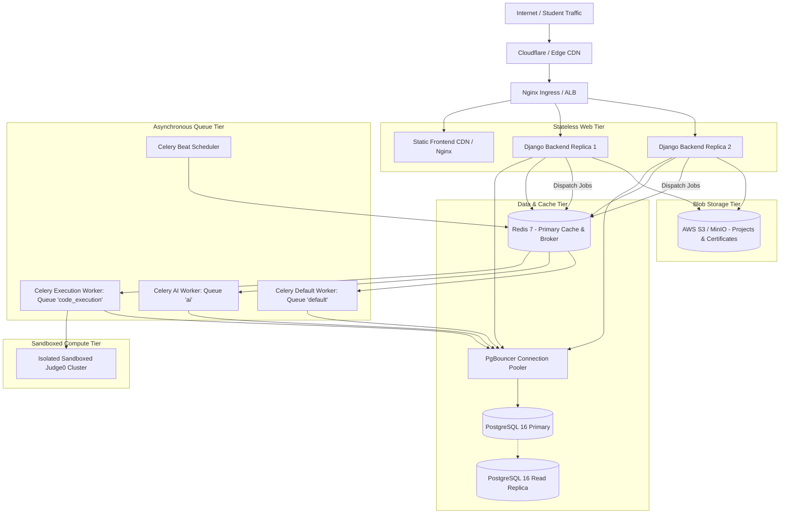

# Production Deployment & Infrastructure Architecture

## 1. 12-Factor Platform Architecture

The GQT Student Portal follows the 12-Factor App methodology:
1. **Codebase:** One tracked codebase in Git with multiple deploys.
2. **Dependencies:** Explicitly isolated via `requirements/` and `package.json`.
3. **Config:** Strictly injected via environment variables (`django-environ`).
4. **Backing Services:** PostgreSQL, Redis, and Judge0 treated as attached resources.
5. **Build, Release, Run:** Discrete build, containerization, and release execution phases.
6. **Processes:** Stateless Django web workers; state stored in PostgreSQL or Redis.
7. **Port Binding:** Self-contained services exporting HTTP on explicit ports.
8. **Concurrency:** Scaled out horizontally via container replicas.
9. **Disposability:** Fast startup, graceful SIGTERM shutdown handlers.
10. **Dev/Prod Parity:** Docker Compose mirrors production container configurations.
11. **Logs:** Emitted as unbuffered structured JSON streams to stdout.
12. **Admin Processes:** One-off management commands executed in ephemeral containers.

---

## 2. Production Topology



---

## 3. Celery Queue Partitioning Strategy

To guarantee that long-running code assessments or AI chats never block critical real-time notifications or auth emails, background jobs are segregated into distinct priority queues:

| Queue Name | Concurrency / Worker Type | Workloads |
|---|---|---|
| `code_execution` | High concurrency (Eventlet / gevent) | Sandboxed judge dispatching, testcase polling |
| `ai` | Medium concurrency | External LLM requests, conversation synthesis |
| `notifications` | Low concurrency (Prefork) | SMS dispatch, emails, push notifications |
| `reports` | 1-2 workers (Prefork) | Daily batch aggregation, PDF certificate rendering |
| `default` | Standard prefork | Generic cache invalidation, audit logging |

---

## 4. Structured Logging & Observability

- **JSON Output Format:** Django outputs structured JSON logs to `stdout` in production:
  ```json
  {
    "timestamp": "2026-09-30T09:40:00.123Z",
    "level": "INFO",
    "logger": "apps.assignments.services",
    "message": "Submission evaluated successfully",
    "request_id": "req-8912-abcdef",
    "student_id": "e6a2b37c-9b1c-4b52-bbf1-8a9d12345678",
    "submission_id": "a123-bc45-...",
    "status": "ACCEPTED",
    "score": 100,
    "duration_ms": 342
  }
  ```
- **Health Check Endpoints:**
  - `GET /health/live/`: Verifies web process is alive.
  - `GET /health/ready/`: Verifies connectivity to PostgreSQL and Redis.
