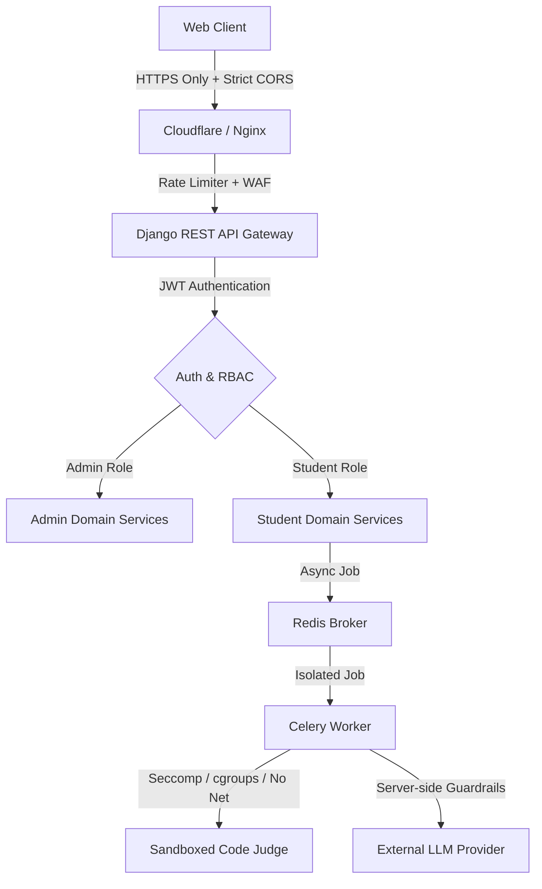

# Security Architecture & Threat Mitigation Blueprint

## 1. Threat Model & Core Security Tenets

The GQT Platform operates on a **Zero Trust** and **Least Privilege** foundation. Because students submit arbitrary source code for execution, strict boundary defenses are maintained.

---

## 2. Authentication & Credential Architecture

### 2.1 Admin-Controlled Onboarding (Zero Public Registration)
- Public registration endpoints (`/register` or `/signup`) are strictly prohibited and do not exist in the codebase.
- Accounts can only be provisioned by authorized `ADMIN` users:
  1. Admin provides student email, mobile, batch, and unique registration ID.
  2. The system generates an account with `onboarding_status = "PENDING_PASSWORD_SET"`.
  3. A cryptographically secure, single-use activation token is generated with a 48-hour expiration.
  4. The student sets their password or completes initial mobile verification to transition to `"ACTIVE"`.

### 2.2 Dual Login Channels
1. **Email & Password:**
   - Password hashing utilizes Argon2id / PBKDF2 with SHA-256 and minimum 100,000 iterations.
   - Enforced complexity: 10+ characters, upper, lower, digit, and special symbol.
2. **Mobile Number & OTP:**
   - OTPs are 6-digit cryptographically pseudo-random numbers (`secrets.SystemRandom()`).
   - OTP hashes are stored in Redis with an exact 5-minute TTL (300 seconds).
   - Maximum 5 attempts allowed per OTP; failure invalidates the token.
   - Request rate limit: Max 3 OTP requests per phone number per hour.

### 2.3 JWT Lifecycle & Token Rotation
- **Access Token:** Short-lived (15 minutes). Sent in the `Authorization: Bearer <token>` header. Contains `user_id`, `role`, and token jti.
- **Refresh Token:** Long-lived (7 days). Exchanged via `/api/v1/auth/refresh/`.
- **Token Rotation:** Every refresh request issues a new refresh token and immediately blacklists the old refresh token (`rest_framework_simplejwt.token_blacklist`).
- **Logout:** Explicitly blacklists the current refresh token in the Redis blacklist table.

---

## 3. Authorization & Role-Based Access Control (RBAC)

The system supports two core roles:
- `ADMIN`: Full access to curriculum management, student onboarding, project grading, override unlocking, analytics, and platform logs.
- `STUDENT`: Scoped access strictly to assigned courses, unlocked modules, their own submissions, daily tasks, and their own AI conversations.

### Object-Level Authorization:
- Students can never query, read, or modify submissions, progress, or profile information belonging to another student (`IsOwnerOrAdmin` permission class).
- Module access is validated before returning problem statements or executing submissions; accessing module $K$ when module $K-1$ is not completed returns `403 Forbidden`.

---

## 4. Sandboxed Code Execution Isolation

Untrusted code submitted by students can execute malicious syscalls, fork bombs, or network exfiltration if not isolated.

### Sandbox Isolation Enforcements:
1. **No Backend Execution:** The Django server never forks or executes student binaries.
2. **Containerized Worker Isolation:** Execution occurs in an isolated worker runtime (e.g., Judge0 or custom runner container).
3. **Linux Kernel Sandboxing:**
   - **cgroups:** Strict memory ceiling (128 MB RAM), CPU quota (1 core, 50% CPU slice).
   - **pids cgroup:** Max process limit (30 processes) to completely neutralize fork bombs.
   - **Namespaces:** Isolated network namespace (`--net=none`) with zero external internet access.
   - **Seccomp Filters:** Whitelist only benign syscalls (`read`, `write`, `exit`, `mmap`, etc.); blocks `socket`, `ptrace`, `kill`, `chroot`.
   - **Ephemeral Read-Only Root:** Container filesystems are mounted read-only with a temporary 10MB tmpfs for compilation artifacts that are purged immediately.
4. **Execution Limits:** Hard wall-clock timeout of 5.0 seconds per testcase.

---

## 5. External AI Provider & LLM Security

- **Server-Side API Key Storage:** LLM API keys (OpenAI / Anthropic) exist **exclusively** in backend environment variables. No client-side exposure.
- **Prompt Injection Defense:** Student inputs are wrapped in system instructions and delimited in markdown blocks to prevent overriding grading rules or leaking prompt templates.
- **Quota & Cost Protection:**
  - Rate limited to 30 requests per student per hour via Redis token bucket.
  - Maximum context window constrained to 1,024 tokens.
  - Solution-giving guardrail: The system prompt instructs the AI to behave as a **Socratic Tutor**, providing hints and debugging pointers rather than full copy-paste solutions.

---

## 6. Web Security & Injection Mitigations

| Vulnerability | Mitigation Strategy |
|---|---|
| **SQL Injection (SQLi)** | 100% parameterization via Django ORM. Raw SQL is strictly banned. |
| **Cross-Site Scripting (XSS)** | React JSX auto-escaping; markdown content in problem descriptions rendered through DOMPurify sanitization. |
| **Cross-Site Request Forgery (CSRF)** | Bearer JWT headers on API endpoints; CSRF token validation enabled on session-authenticated admin endpoints. |
| **Brute Force Attacks** | Redis rate-limiting (Django Ratelimit) on login and OTP verification endpoints; account lock after 5 consecutive failures. |
| **Malicious File Uploads** | Project uploads restricted to `.zip`, `.pdf`, `.png`, `.jpg`. Validated via file signature (magic bytes) + file size ceiling (25 MB max). |
| **Security Headers** | Nginx / Django `SecurityMiddleware` configures `HSTS`, `X-Content-Type-Options: nosniff`, `X-Frame-Options: DENY`, and strict `Content-Security-Policy`. |
| **Secrets Management** | Zero credentials in Git. Injected via `.env` in local development and encrypted secrets managers in production. |
