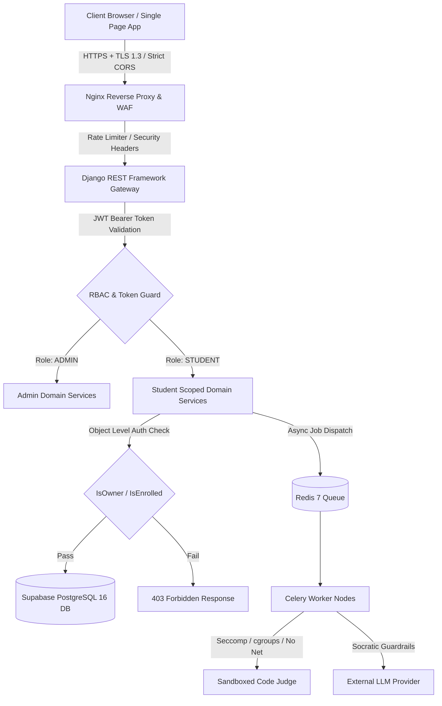

# Security Architecture & Threat Mitigation Blueprint — Phase 0

## 1. Threat Model & Core Security Tenets

The **GQT Student Learning and Coding Assessment Platform** operates on a **Zero Trust**, **Least Privilege**, and **Defense-in-Depth** architecture. 

Because students execute arbitrary code in multiple programming languages and access sensitive academic credentials, rigorous boundaries are enforced across all layers:

---

## 2. Authentication & Credential Architecture

### 2.1 Admin-Controlled Onboarding (Zero Public Self-Registration)
- Public self-registration (`/register` or `/signup`) is strictly prohibited.
- Accounts are created solely by authenticated administrators via `POST /api/v1/admin/students/onboard/`.
- Newly provisioned accounts are initialized with:
  - `onboarding_status = 'PENDING_ACTIVATION'`
  - `is_active = TRUE`
  - A cryptographically generated, single-use activation token with a 48-hour expiration window.
- The student sets their password or completes mobile OTP verification to activate their account (`onboarding_status = 'ACTIVE'`).

### 2.2 Account Status vs. Portal Access Status
The platform cleanly separates Account Lifecycle State from Portal Access/Authorization State:

| Account Dimension | Database Field | Allowed Enums / Values | Purpose |
|---|---|---|---|
| **Lifecycle State** | `User.onboarding_status` | `PENDING_ACTIVATION`, `ACTIVE`, `SUSPENDED`, `REVOKED` | Tracks administrative onboarding lifecycle. |
| **Portal Access Toggle** | `User.is_active` | `TRUE`, `FALSE` | Instant global circuit-breaker for session termination and login blocking. |

When an Admin suspends or revokes a student:
1. `User.is_active` is set to `FALSE`.
2. Existing JWT refresh tokens are immediately blacklisted in Redis.
3. Active WebSocket / API sessions are terminated with `401 Unauthorized` on the subsequent request.

### 2.3 JWT Lifecycle, Token Rotation & Multi-User Isolation
- **Access Token:** Short-lived (15 minutes). Contains `user_id`, `role`, and token `jti`.
- **Refresh Token:** Long-lived (7 days). Exchanged via `/api/v1/auth/refresh/`.
- **Automatic Token Rotation:** Every refresh invocation issues a new access/refresh pair and immediately revokes the consumed refresh token (`rest_framework_simplejwt.token_blacklist`).
- **Logout:** Explicitly invalidates the active refresh token in Redis.
- **Multi-User Refresh Safety:** The client application clears all in-memory query caches (TanStack Query) on logout to guarantee that switching between Student A and Student B never leaks cached state.

---

## 3. Authorization & Insecure Direct Object Reference (IDOR) Defense

### 3.1 Object-Level Authorization Rules
All data retrieval and mutation endpoints validate ownership at the query level:
- **Student Profile:** Students can query and update only their own profile (`user_id = request.user.id`).
- **Code Submissions & Results:** Queries filter on `student_id = request.user.student_profile.id`. Attempting to access another student's submission ID returns `404 Not Found` or `403 Forbidden`.
- **Module & Curriculum Gating:** Access to Module $K$ requires verifying that Module $K-1$ was completed with passing criteria or has an active administrative override in `StudentModuleProgress`.
- **Support Inquiries:** Support ticket creation automatically binds `student_id` to `request.user.student_profile.id` on the server. Form field manipulation cannot impersonate other students.

### 3.2 Role-Based Access Control (RBAC) Matrix

| Domain / Action | Anonymous | Student | Admin |
|---|---|---|---|
| Email / Mobile Login & OTP | Allowed | Allowed | Allowed |
| View Own Dashboard, Points & Streak | Denied | Allowed | Allowed (via Student Dossier) |
| View 17-Topic Sequential Roadmap | Denied | Scoped (Lock Rules) | Full (Audit View) |
| Submit Code to Coding Question | Denied | Allowed (Unlocked Topics) | Preview Mode |
| View Hidden Testcases | Denied | **Denied** | Allowed |
| Manual Module Unlock Override | Denied | **Denied** | Allowed |
| View Cohort Leaderboard | Denied | Allowed | Allowed |
| Submit Support Inquiry | Denied | Allowed (Bound to Self) | N/A |
| Manage Support Tickets | Denied | **Denied** | Full Access |
| Provision New Student | Denied | **Denied** | Full Access |
| Toggle Student Access / Suspend | Denied | **Denied** | Full Access |
| Generate Batch Reports (CSV/PDF) | Denied | **Denied** | Full Access |
| Public Certificate Verification | Allowed (SHA hash) | Allowed | Allowed |

---

## 4. Sandboxed Code Execution Isolation

Untrusted user-submitted code in Python, Java, C, C++, and JavaScript is isolated to prevent denial-of-service, escape, or data exfiltration:

1. **Decoupled Execution:** The Django web server **never** executes or compiles user code directly. Code is queued via Redis and dispatched to isolated execution sandbox nodes.
2. **Linux Container & Kernel Sandboxing:**
   - **Network Isolation:** Sandbox containers run with `--net=none` (zero inbound/outbound socket creation).
   - **cgroups Memory Ceiling:** Strict hard limit of 128 MB RAM per execution job.
   - **cgroups CPU Ceiling:** Limited to 1 CPU core with a 50% CPU quota.
   - **pids cgroup Limit:** Maximum 30 concurrent processes to neutralize fork-bomb vulnerabilities.
   - **Seccomp System Call Whitelisting:** Whitelist restricts calls to basic IO/memory (`read`, `write`, `mmap`, `brk`, `exit`). Calls to `socket`, `ptrace`, `kill`, `chroot`, `mount` trigger immediate termination.
   - **Read-Only Root Filesystem:** Root filesystem is mounted read-only with a temporary 10 MB `tmpfs` for compiler artifacts, purged immediately upon completion.
   - **Execution Wall-Clock Timeout:** Hard timeout of 2.0 to 5.0 seconds per testcase.

---

## 5. Public Certificate Verification & Cryptographic Integrity

1. **Unique Cryptographic Verification Hash:**
   - Every issued certificate generates a deterministic SHA-256 hash derived from:
     $$\text{hash} = \text{HMAC-SHA256}(\text{SECRET\_KEY}, \text{student\_id} + \text{course\_id} + \text{issue\_date})$$
2. **PII-Safe Public Verification Endpoint (`GET /api/v1/certificates/verify/{hash}/`):**
   - Does not require authentication.
   - Returns only public verification attributes: Course title, completion date, sanitized student name (`Rahul S.****`), and verification validity.
   - Exposes zero private student emails, phone numbers, or administrative notes.

---

## 6. Notification Deep Linking & Safe Navigation

1. **Whitelisted Internal Route Schemas:**
   - In-app notification action targets (`action_route`) are strictly constrained to whitelisted client routes (e.g. `/assignments/:id`, `/tasks/:id`, `/projects/:id`).
   - Storing arbitrary URLs or external domain redirects is prohibited to eliminate Open Redirect and Server-Side Request Forgery (SSRF) vectors.

---

## 7. Web Application Defense & Hardening

| Attack Vector | Mitigation Technique |
|---|---|
| **SQL Injection (SQLi)** | 100% parameterized queries via Django ORM & Supabase PostgreSQL engine. Raw SQL queries are banned in code reviews. |
| **Cross-Site Scripting (XSS)** | React automatic JSX escaping; Markdown in problem statements, lectures, and announcements sanitized via DOMPurify with strict HTML whitelisting. |
| **Cross-Site Request Forgery (CSRF)** | Stateless Bearer JWT authorization for REST APIs; CSRF tokens enforced on any session-authenticated views. |
| **Brute-Force & Credential Stuffing** | Redis-backed token bucket rate limiting on `/login/` and `/otp/send/` endpoints; automatic temporary lockouts after 5 failed attempts. |
| **File Upload Exploits** | Project ZIP/PDF attachments checked against magic bytes (file signature verification) + 25 MB max upload ceiling; stored in isolated Supabase Storage buckets with non-executable permissions. |
| **Clickjacking & Security Headers** | Nginx / Django `SecurityMiddleware` injects `X-Frame-Options: DENY`, `X-Content-Type-Options: nosniff`, `Referrer-Policy: strict-origin-when-cross-origin`, and Content Security Policy (CSP). |
